```{r setup, include=FALSE}
knitr::opts_chunk$set(echo = FALSE)
```


TLDR:

Clustering similar spatial patterns requires one or more raster  datasets for the same area. Input data is divided into many sub-areas,  and spatial signatures are derived for each sub-area. Next, distances  between signatures for each sub-area are calculated and stored in a  distance matrix. The distance matrix can be used to create clusters of  similar spatial patterns. Quality of clusters can be assessed visually  using a pattern mosaic or with dedicated quality metrics.

# Spatial data

To reproduce the calculations in the following post, you need to download all of relevant datasets using the code below:

```R
library(osfr)
dir.create("data")
osf_retrieve_node("xykzv") %>%
        osf_ls_files(n_max = Inf) %>%
        osf_download(path = "data",
                     conflicts = "overwrite")
```

You should also attach the following packages:

```R
library(sf)
library(stars)
library(motif)
library(tmap)
library(dplyr)
library(readr)
```

# Land cover and landforms in Africa

The `data/land_cover.tif` contains land cover data and `data/landform.tif` is landform data for Africa. Both are single categorical rasters of the same extent and the same resolution (300 meters) that can be read into R using the [`read_stars()`](https://r-spatial.github.io/stars/reference/read_stars.html) function.

```R
lc = read_stars("data/land_cover.tif")
lf = read_stars("data/landform.tif")
```

Additionally, the `data/lc_palette.csv` file contains information about colors and labels of each land cover category, and `data/lf_palette.csv` stores information about colors and labels of each landform class.

```R
lc_palette_df = read_csv("data/lc_palette.csv")
lf_palette_df = read_csv("data/lf_palette.csv")
names(lc_palette_df$color) = lc_palette_df$value
names(lf_palette_df$color) = lf_palette_df$value
```

Both datasets can be visualized with **tmap**.

```R
tm_lc = tm_shape(lc) +
        tm_raster(style = "cat",
                  palette = lc_palette_df$color,
                  labels = lc_palette_df$label,
                  title = "Land cover:") +
        tm_layout(legend.position = c("LEFT", "BOTTOM"))
tm_lc
```

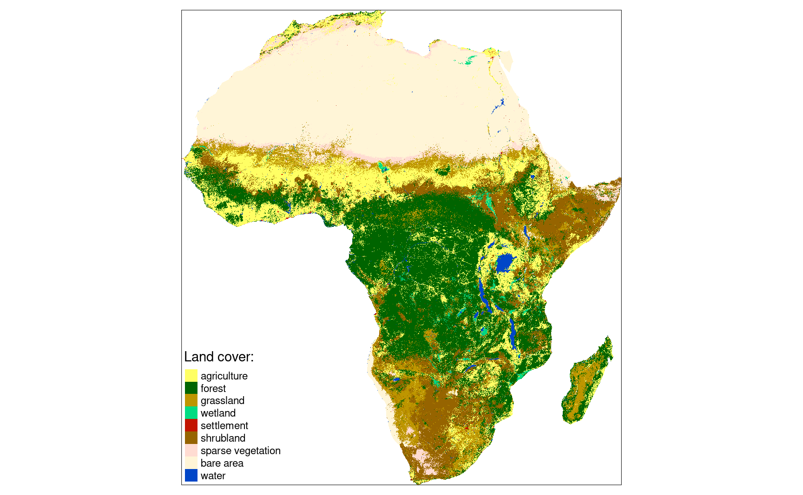

```R
tm_lf = tm_shape(lf) +
        tm_raster(style = "cat",
                  palette = lf_palette_df$color,
                  labels = lf_palette_df$label,
                  title = "Landform:") +
        tm_layout(legend.outside = TRUE)
tm_lf
```

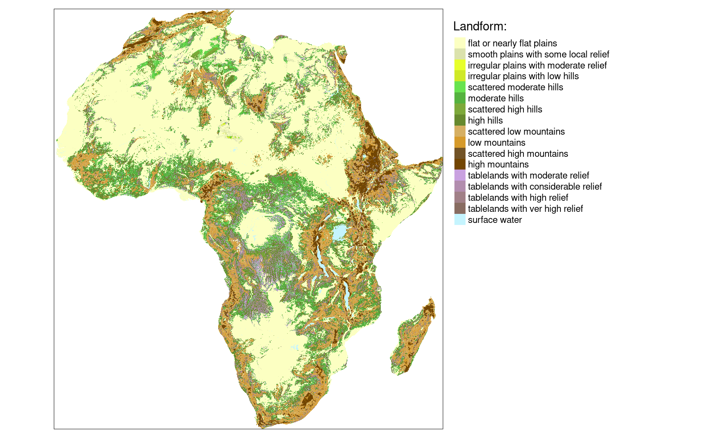

We can combine these two datasets together with the [`c()`](https://rdrr.io/r/base/c.html) function.

```R
eco_data = c(lc, lf)
```

The problem now is how to find clusters of similar spatial patterns of both land cover categories and landform classes.

# Clustering spatial patterns

The basic step in clustering spatial patterns is to calculate a proper signature for each spatial window using the [`lsp_signature()`](https://nowosad.github.io/motif/reference/lsp_signature.html) function. Here, we use the *in*tegrated *co*-occurrence *ve*ctor (`type = "cove"`) representation.  In this example, we use a window of 300 cells by 300 cells (`window = 300`). This means that our search scale will be 90 km (300 cells x data  resolution) - resulting in dividing the whole area into about 7,500  regular rectangles of 90 by 90 kilometers.

This operation could take a few minutes.

```R
eco_signature = lsp_signature(eco_data,
                              type = "incove",
                              window = 300)
```

The output, `eco_signature` contains numerical  representation for each 90 by 90 km area. Notice that it has 3,838 rows  (not 7,500) - this is due to removing areas with a large number of  missing values before calculations[1](https://nowosad.github.io/post/motif-bp5/#fn:1). 

# Distance matrix

Next, we can calculate the distance (dissimilarity) between patterns of each area. This can be done with the [`lsp_to_dist()`](https://nowosad.github.io/motif/reference/lsp_to_dist.html) function, where we must provide the output of [`lsp_signature()`](https://nowosad.github.io/motif/reference/lsp_signature.html) and a distance measure used (`dist_fun = "jensen-shannon"`). This operation also could take a few minutes.

```R
eco_dist = lsp_to_dist(eco_signature, dist_fun = "jensen-shannon")
```

The output, `eco_dist`, is of a `dist` class,  where small values show that two areas have a similar joint spatial  pattern of land cover categories and landform classes.

```R
class(eco_dist)

## [1] "dist"
```

# Hierarchical clustering

Objects of class `dist` can be used by many existing R functions for clustering. It includes different approaches of hierarchical clustering ([`hclust()`](https://rdrr.io/r/stats/hclust.html), [`cluster::agnes()`](https://rdrr.io/pkg/cluster/man/agnes.html), [`cluster::diana()`](https://rdrr.io/pkg/cluster/man/diana.html)) or fuzzy clustering ([`cluster::fanny()`](https://rdrr.io/pkg/cluster/man/fanny.html)). In the below example, we use hierarchical clustering using [`hclust()`](https://rdrr.io/r/stats/hclust.html), which expects a distance matrix as the first argument and a linkage  method as the second one. Here, we use the Ward’s minimum variance  method (`method = "ward.D2"`) that minimizes the total within-cluster variance.

```R
eco_hclust = hclust(eco_dist, method = "ward.D2")
plot(eco_hclust)
```

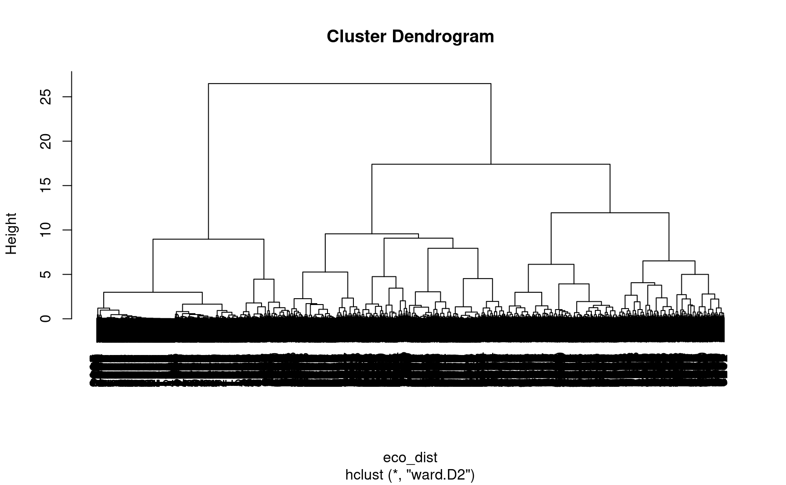

Graphical representation of the hierarchical clustering is called a  dendrogram, and based on the obtained dendrogram, we can divide our  local landscapes into a specified number of groups using [`cutree()`](https://rdrr.io/r/stats/cutree.html). In this example, we use eight classes (`k = 8`) to create a fairly small number of clusters to showcase the presented methodology.

```R
clusters = cutree(eco_hclust, k = 8)
```

However, a decision about the number of clusters in real-life cases should be based on the goal of the research.

# Clustering results

The `lsp_add_clusters` function adds: a column `clust` with a cluster number to each area, and converts the result to an `sf` object.

```R
eco_grid_sf = lsp_add_clusters(eco_signature,
                               clusters)
```

The clustering results can be further visualized using **tmap**.

```R
tm_clu = tm_shape(eco_grid_sf) +
        tm_polygons("clust", style = "cat", palette = "Set2", title = "Cluster:") +
        tm_layout(legend.position = c("LEFT", "BOTTOM"))
tm_clu
```

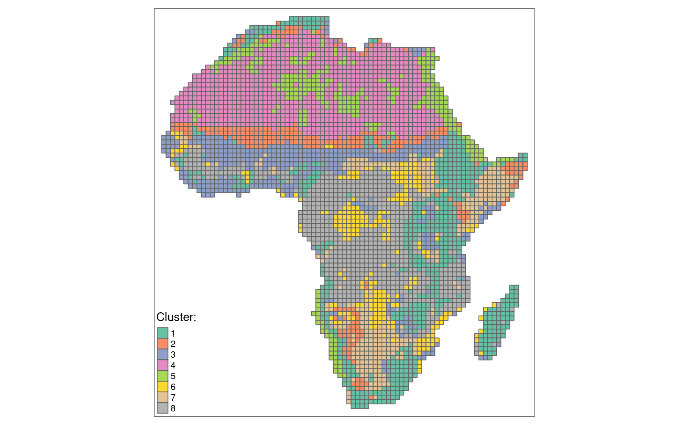

Most clusters form continuous regions, so we could merge areas of the same clusters into larger polygons.

```R
eco_grid_sf2 = eco_grid_sf %>%
        dplyr::group_by(clust) %>%
        dplyr::summarize()
```

The output polygons can then be superimposed on maps of land cover categories and landform classes.

```R
tm_shape(eco_data) +
                tm_raster(style = "cat",
                          palette = list(lc_palette_df$color, lf_palette_df$color)) +
  tm_facets(ncol = 2) +
  tm_shape(eco_grid_sf2) +
  tm_borders(col = "black") +
  tm_layout(legend.show = FALSE, 
            title.position = c("LEFT", "TOP"))
```

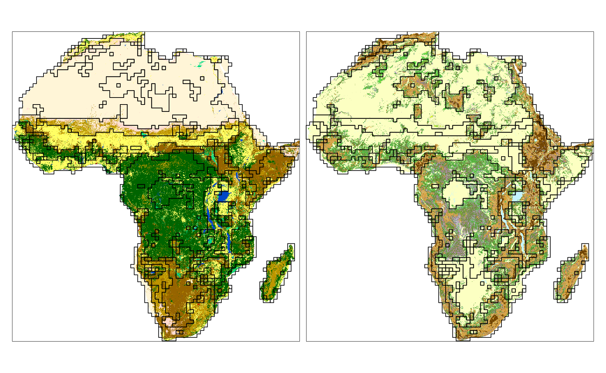

We can see that many borders (black lines) contain areas with both  land cover or landform patterns distinct from their neighbors. Some  clusters are also only distinct for one variable (e.g., look at Sahara  on the land cover map).

# Clustering quality

We can also calculate the quality of the clusters with the [`lsp_add_quality()`](https://nowosad.github.io/motif/reference/lsp_add_quality.html) function. It requires an output of [`lsp_add_clusters()`](https://nowosad.github.io/motif/reference/lsp_add_clusters.html) and an output of [`lsp_to_dist()`](https://nowosad.github.io/motif/reference/lsp_to_dist.html), and adds three new variables: `inhomogeneity`, `distinction`, and `quality`.

```R
eco_grid_sfq = lsp_add_quality(eco_grid_sf, eco_dist, type = "cluster")
```

Inhomogeneity (`inhomogeneity`) measures a degree of  mutual distance between all objects in a cluster. This value is between 0 and 1, where the small value indicates that all objects in the cluster  represent consistent patterns, so the cluster is pattern-homogeneous.  Distinction (`distinction`) is an average distance between  the focus cluster and all the other clusters. This value is between 0  and 1, where the large value indicates that the cluster stands out from  the rest of the clusters. Overall quality (`quality`) is calculated as `1 - (inhomogeneity / distinction)`. This value is also between 0 and 1, where increased values indicate better quality of clustering.

We can create a summary of each clusters' quality using the code below.

```R
eco_grid_sfq2 = eco_grid_sfq %>%
        group_by(clust) %>%
        summarise(inhomogeneity = mean(inhomogeneity),
                  distinction = mean(distinction),
                  quality = mean(quality))
```

| clust | inhomogeneity | distinction |   quality |
| ----: | ------------: | ----------: | --------: |
|     1 |     0.5064706 |   0.7724361 | 0.3443204 |
|     2 |     0.4038704 |   0.7023297 | 0.4249561 |
|     3 |     0.3377875 |   0.7065250 | 0.5219029 |
|     4 |     0.1161293 |   0.7921515 | 0.8534002 |
|     5 |     0.3043422 |   0.7366735 | 0.5868696 |
|     6 |     0.2774136 |   0.6849140 | 0.5949657 |
|     7 |     0.2926504 |   0.7149212 | 0.5906537 |
|     8 |     0.3486704 |   0.7579511 | 0.5399830 |

The created clusters show a different degree of quality metrics. The  fourth cluster has the lowest inhomogeneity and the largest distinction, and therefore the best quality. The first cluster has the most  inhomogeneous patterns, and while its distinction from other clusters is relatively large, its overall quality is the worst.

```R
tm_inh = tm_shape(eco_grid_sfq2) +
        tm_polygons("inhomogeneity", style = "cont", palette = "magma")

tm_iso = tm_shape(eco_grid_sfq2) +
        tm_polygons("distinction", style = "cont", palette = "-inferno")

tm_qua = tm_shape(eco_grid_sfq2) +
        tm_polygons("quality", style = "cont", palette = "Greens")

tm_cluster3 = tmap_arrange(tm_clu, tm_qua, tm_inh, tm_iso, ncol = 2)
tm_cluster3
```

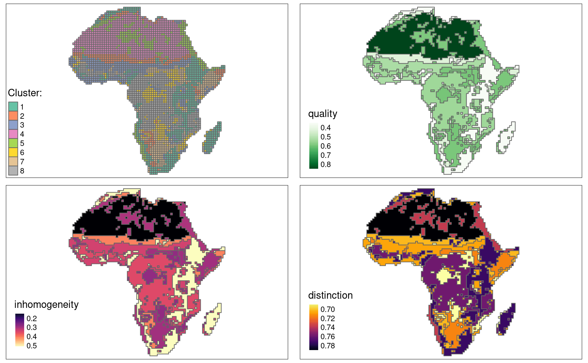

# Understanding clusters

Inhomogeneity can also be assessed visually with a pattern mosaic.  Pattern mosaic is an artificial rearrangement of a subset of randomly  selected areas belonging to a given cluster.

Using the code below, we randomly selected 100 areas for each cluster. It could take a few minutes.

```R
eco_grid_sample = eco_grid_sf %>% 
  filter(na_prop == 0) %>% 
  group_by(clust) %>% 
  slice_sample(n = 100)
```

Next, we can extract a raster for each selected area with the [`lsp_add_examples()`](https://nowosad.github.io/motif/reference/lsp_add_examples.html) function.

```R
eco_grid_examples = lsp_add_examples(eco_grid_sample, eco_data)
```

Finally, we can use the [`lsp_mosaic()`](https://nowosad.github.io/motif/reference/lsp_mosaic.html) function, which creates raster mosaics by rearranging spatial data for  sample areas. Note that this function is still experimental and can  change in the future.

```R
eco_mosaic = lsp_mosaic(eco_grid_examples)
```

The output is a `stars` object with the third dimension (`clust`) representing clusters, from which we can use [`slice()`](https://dplyr.tidyverse.org/reference/slice.html) to extract a raster mosaic for a selected cluster. For example, the raster mosaic for fourth cluster looks like this:

```R
eco_mosaic_c4 = slice(eco_mosaic, clust, 4)

tm_shape(eco_mosaic_c4) +
  tm_raster(style = "cat",
            palette = list(lc_palette_df$color, lf_palette_df$color)) +
  tm_facets(ncol = 2) +
  tm_layout(legend.show = FALSE)
```

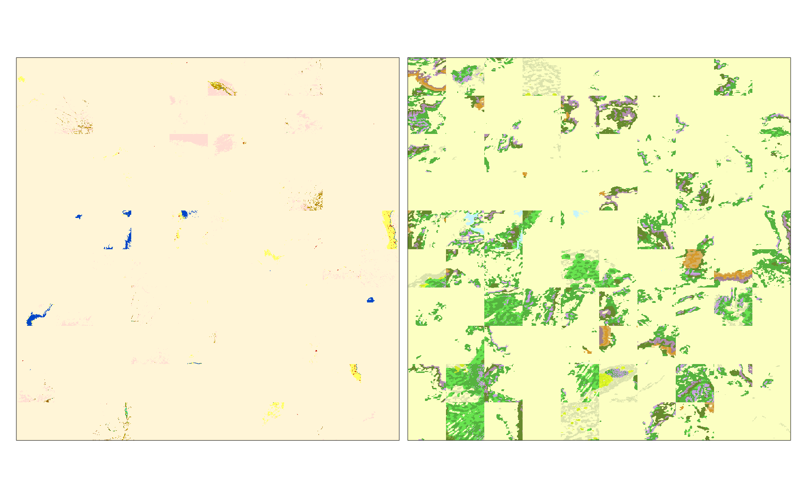

We can see that the land cover patterns for this cluster are very  simple and homogeneous. The landform patterns are slightly more complex  and less homogeneous.

And the raster mosaic for first cluster is:

```R
eco_mosaic_c1 = slice(eco_mosaic, clust, 1)

tm_shape(eco_mosaic_c1) +
  tm_raster(style = "cat",
            palette = list(lc_palette_df$color, lf_palette_df$color)) +
  tm_facets(ncol = 2) +
  tm_layout(legend.show = FALSE)
```

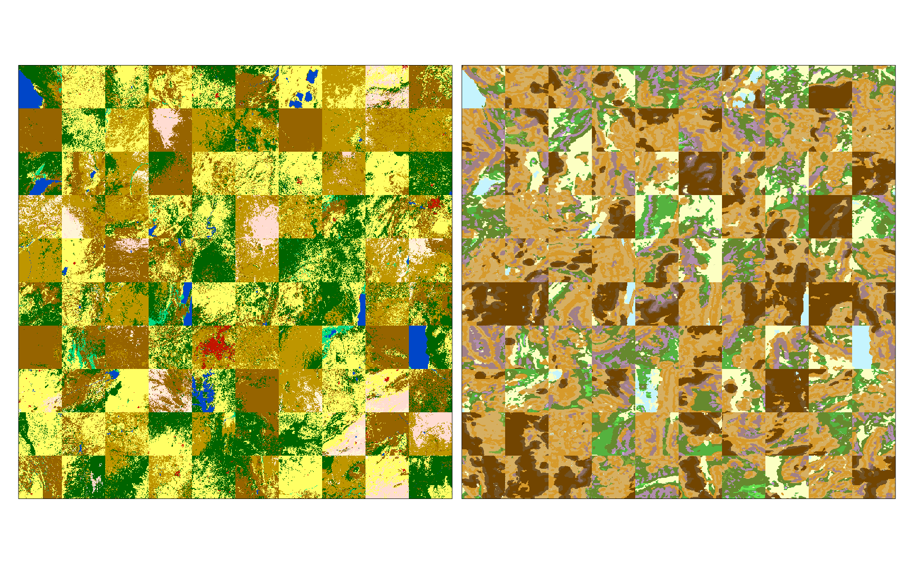

Patterns of both variables in this cluster are more complex and  heterogeneous. This result could suggest that additional clusters could  be necessary to distinguish some spatial patterns.

# Summary

The pattern-based clustering allows for grouping areas with similar  spatial patterns. The above example shows the search based on  two-variable raster data (land cover and landform), but by using [a different spatial signature](https://nowosad.github.io/post/motif-bp2), it can be performed on a single variable raster as well. R code for the pattern-based clustering can be found [here](https://github.com/Nowosad/motif-examples/blob/master/R/clustering.R), with other examples described in the [Spatial patterns' clustering](https://nowosad.github.io/motif/articles/articles/v5_cluster.html) vignette.


------

1. See the `threshold` argument for more details. [↩︎](https://nowosad.github.io/post/motif-bp5/#fnref:1)


***

**This post is actually part of a series - the first post of these is here, and if others are relevant really read the series on the original website:**

***

# Pattern-based spatial analysis in R: an introduction 

TLDR:  **motif** is an R package aimed for pattern-based spatial analysis. It allows for spatial analysis such as search, change detection, and clustering to be performed on spatial patterns. This blog post introduces basic ideas  behind the pattern-based spatial analysis, and shows the types of  problems to which it can be applied.

# Spatial patterns

Discovering and describing patterns is a vital part of many spatial  analysis. However, spatial data is gathered in many ways and forms,  which requires different approaches to expressing spatial patterns.  Other methods are applied when we work with numerical or categorical  variables, also other methods are used to find patterns in point  datasets, lines datasets, or raster datasets. Next, patterns and their  relevance depend on a studied scale, with different patterns found on  small or large scales, or data of different spatial resolutions.  Finally, the way we describe patterns should depend on our main goal.

In this blog post, I only focus on a small subset of possible  problems related to spatial patterns - I am only interested in  categorical raster data. Categorical rasters, such as land cover maps,  soil categories, or any other categorized images, express spatial  patterns by two inter-related properties: composition and configuration. Composition shows how many different categories we have, and how much  area they occupy, while configuration focuses on the spatial arrangement of the categories.

# Landscape metrics

Spatial patterns in categorical raster data are most often described  by landscape metrics (landscape indices). A landscape metric is a single numerical value expressing some property of a raster, such as diversity of categories or spatial aggregation of classes. In the last 40 or so  years, several hundred of different spatial metrics were developed. They are widely used in the field of landscape ecology, but their  application can be also found in some other distant fields, even such as clinical pathology (laboratory medicine).

The **landscapemetrics** package allows calculating various landscape metrics in R. It contains a simple categorical raster named `landscape` with three classes, which we can use to calculate some metrics. To learn more about these ideas and the **landscapemetrics** package visit https://r-spatialecology.github.io/landscapemetrics.

```r
library(landscapemetrics)
library(raster)
plot(landscape)
```

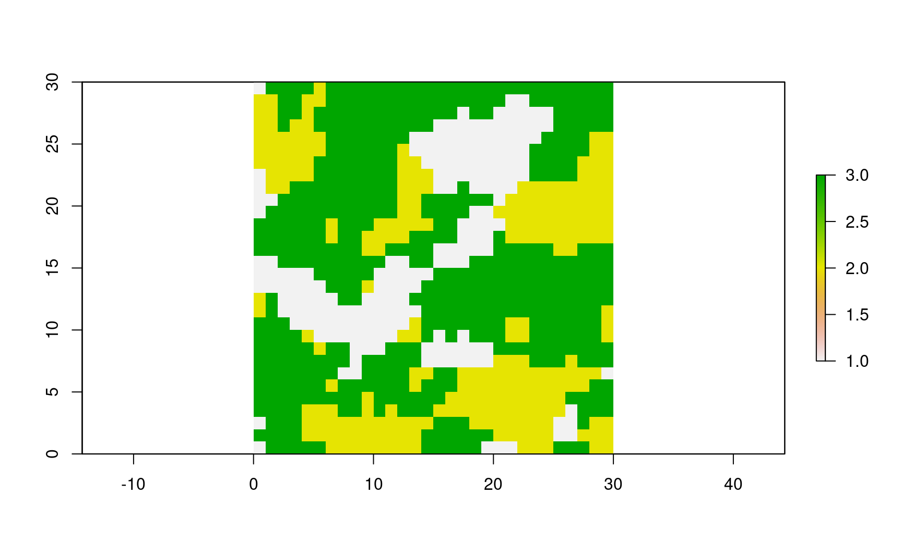

For example, the [`lsm_l_shdi()`](https://r-spatialecology.github.io/landscapemetrics/reference/lsm_l_shdi.html) function calculates Shannon’s diversity index, which shows how many  categories we have and what are they abundance. It is 0 when only one  patch is present and increases, without limit, as the number of classes  increases, while their proportions are similar.

```r
lsm_l_shdi(landscape)

## # A tibble: 1 x 6
##   layer level     class    id metric value
##   <int> <chr>     <int> <int> <chr>  <dbl>
## 1     1 landscape    NA    NA shdi    1.01
```

The [`lsm_l_ai()`](https://r-spatialecology.github.io/landscapemetrics/reference/lsm_l_ai.html) function focuses on the configuration of spatial patterns by  calculating the aggregation index. It equals to 0 for maximally  disaggregated areas and 100 for maximally aggregated ones.

```r
lsm_l_ai(landscape)

## # A tibble: 1 x 6
##   layer level     class    id metric value
##   <int> <chr>     <int> <int> <chr>  <dbl>
## 1     1 landscape    NA    NA ai      81.1
```

# Spatial signatures

The above examples show how we condensed some information about  raster data to just one number. It can be useful in a multitude of cases when we want to connect some aspect of a spatial pattern to external  processes. However, what do to, if our goal is to find areas with  similar spatial patterns?

In theory, we could calculate landscape metrics for many areas and  then search for those which have the most similar values to our area of  interest. This approach, however, leaves us with a number of problems,  including which landscape metrics to use. Many landscape metrics are  highly correlated, and their interrelations are hard to interpret.

An alternative approach, in this case, is to use a spatial signature. A spatial signature is a multi-number description that compactly stores information about the composition and configuration of a spatial  pattern. Therefore, instead of having just one number representing a  raster, we have several numbers that condense information about this  location. We can calculate spatial signatures for many rasters, which  allows us to find the most similar rasters, describe changes between  rasters, or group (cluster) rasters based on the spatial patterns.

# motif

Search, change detection, and clustering of spatial patterns have been possible in GRASS GIS using [the GeoPAT module](http://sil.home.amu.edu.pl/index.php?id=software) or command-line tool [GeoPAT 2](https://github.com/Nowosad/geopat2). All of the above actions can also be now performed natively in R with the **motif** package. In a series of blog posts, I plan to show and explain several use cases. They include:

*A. Finding areas similar to the area of interest*

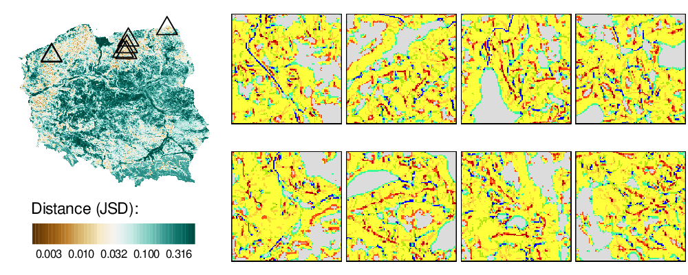

*B. Comparing changes between two times*

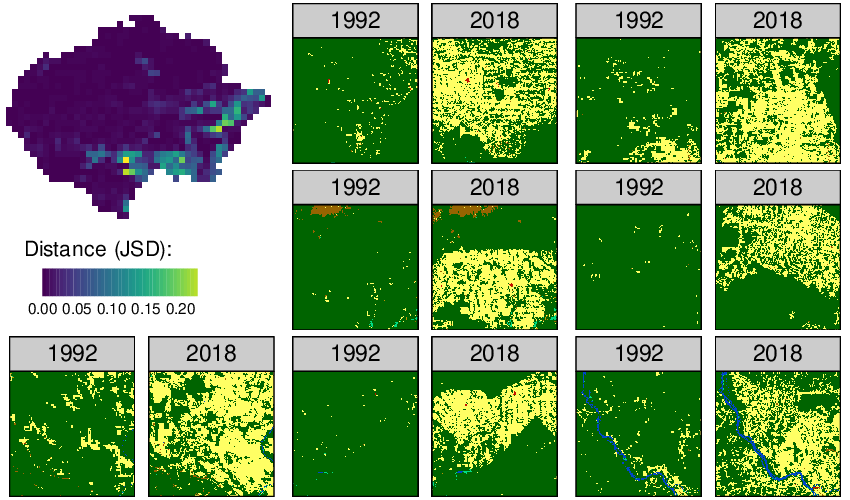

*C. Clustering areas with similar patterns of more than one layer of data*

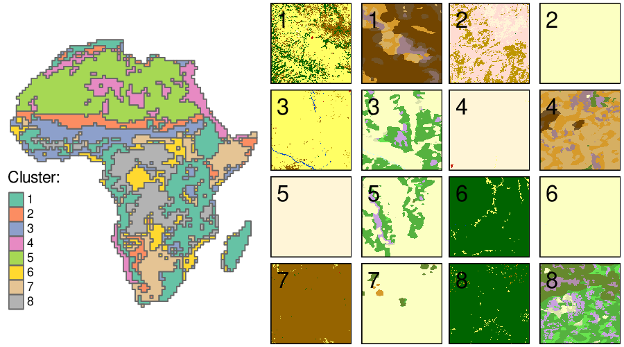

If you do not want to wait for the next blog post, you can install the the **motif** package with:

```r
install.packages("motif")
```

You can read more about it in the [Landscape Ecology article](https://link.springer.com/article/10.1007/s10980-020-01135-0) or [its preprint](https://ecoevorxiv.org/kj7fu):

> Nowosad, J. Motif: an open-source R tool for pattern-based spatial analysis. Landscape Ecol (2020). https://doi.org/10.1007/s10980-020-01135-0

You can also visit the package website at https://nowosad.github.io/motif and the GitHub repository with examples at https://github.com/Nowosad/motif-examples.