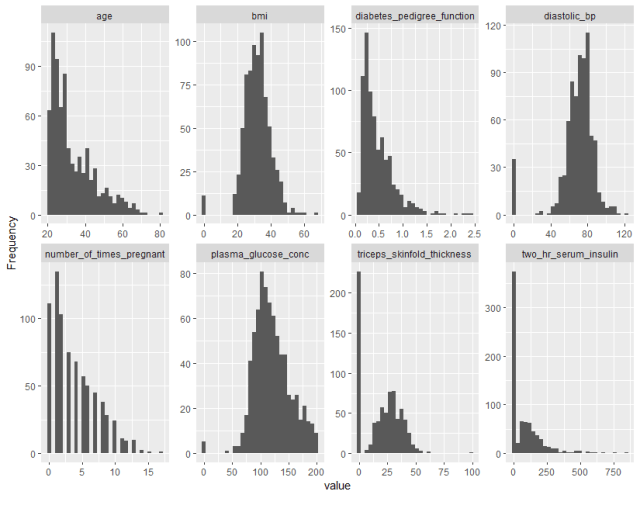
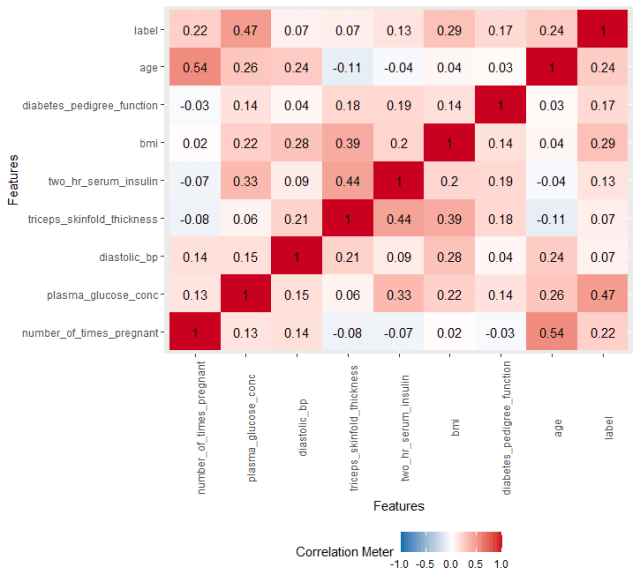

```{r setup, include=FALSE}
knitr::opts_chunk$set(echo = FALSE)
```

Data exploration is an important part of the modeling process. It can also take up a fair amount of time.  The awesome [DataExplorer](https://cran.r-project.org/web/packages/DataExplorer/DataExplorer.pdf) package in R aims to make this process easier.  To get started with **DataExplorer**, you’ll need to install it like below:

```R
install.packages``(``"DataExplorer"``)
```

Let’s use **DataExplorer** to explore a dataset on diabetes.

```R
# load DataExplorer
library(DataExplorer)
 
# read in dataset
diabetes_data <- read.csv("https://raw.githubusercontent.com/jbrownlee/Datasets/master/pima-indians-diabetes.csv", header = FALSE)
 
# fix column names
names(diabetes_data) <- c("number_of_times_pregnant", "plasma_glucose_conc", "diastolic_bp", "triceps_skinfold_thickness", "two_hr_serum_insulin", "bmi", "diabetes_pedigree_function", "age", "label")
 
# create report
create_report(diabetes_data)
```

Running the *create_report* line of code above will generate  an HTML report file containing a collection of useful information about  the data.  This includes:

Basic statistics, such as number of rows and columns, number of  columns with missing data, count of continuous variables vs. discrete,  and the total memory allocation

Data type for each field

Missing data percentages for each column

Univariate distribution for each column

QQ plots

Correlation analysis

PCA


 That’s right – a single line of code can generate all of the above for a given dataset!  It’s also possible to get each of these pieces  individually.  For example, in a single line of code, we can generate  histograms for all the numeric variables in the dataset.

```R
plot_histogram(diabetes_data)
```



Similarly, we can get bar plots for all categorical variables in the dataset

```R
plot_bar(diabetes_data)
```

Here’s an example getting the correlation plot:

```R
plot_correlation(diabetes_data)
```



### **Configuring the report**

It’s also possible to make adjustments to the output generated by *create_report*.  For example, if you don’t want the QQ plots, you could set *add_plot_qq = FALSE*

```R
config <- ``configure_report``(add_plot_qq = ``FALSE``)` `create_report``(config = config)
```

### **One hot encoding**

**DataExplorer** also comes with a function to perform  one hot encoding.  You can one hot encode all the categorical variables  in the dataset by passing the data frame name to the *dummify* function.  In this case, we don’t have any categorical variables to encode, so the function will generate a warning.

```R
dummify``(diabetes_data)
```


