```{r setup, include=FALSE}
knitr::opts_chunk$set(echo = FALSE)
```

DV NB: not sure why trying to use XGBoost when there are only two variables...

# Time Series Forecasting with XGBoost and Feature Importance

Those who follow my articles know that trying to predict gold prices  has become an obsession for me these days. And I am also wondering which factors affect the prices. For the gold prices per gram in Turkey, are  told that two factors determine the results: USA prices per ounce and  exchange rate for the dollar and the Turkish lira. Let’s check this  perception, but first, we need an algorithm for this.

In recent years, XGBoost is an uptrend machine learning algorithm in time series modeling. XGBoost (**Extreme Gradient Boosting**) is a supervised learning algorithm based on boosting tree models. This  kind of algorithms can explain how relationships between features and  target variables which is what we have intended. We will try this method for our time series data but first, explain the mathematical background of the related tree model.

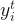

- K represents the number of tree
- 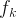 represents the basic tree model.

We need a function that trains the model by measuring how well it fits the training data. This is called **the objective function**.

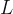

- 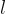 represents the loss function which is the error between the predicted values and observed values.
-  is **the regularization function** to prevent overfitting.

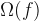

- T represents the leaves, the number of **leaf nodes** of each tree. Leaf node or terminal node means that has no child nodes.
- 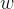 represents the score (weight) of the leaves of each tree, so it is calculated in euclidean norm.
- 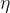 represents the learning rate which is also called the shrinkage  parameter. With shrinking the weights, the model is more robust against  the closeness to the observed values. This prevents overfitting. It is  between 0 and 1. The lower values mean that the more trees, the better  performance, and the longer training time.
- 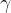 represents the splitting threshold. The parameter is used to prevent  the growth of a tree so the model is less complex and more robust  against overfitting. The leaf node would split  if the information gain  less than . Its range is at 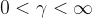

Now, we can start to examine our case we mention at the beginning of  the article. In order to do that, we are downloading the dataset we are  going to use, from [here](https://github.com/mesdi/xgboost/blob/main/xautry_reg.xlsx?raw=true).

```R
#Building data frame
library(readxl)
 
df_xautry <- read_excel("datasource/xautry_reg.xlsx")
df_xautry$date <- as.Date(df_xautry$date)
 
#Splitting train and test data set
train <- df_xautry[df_xautry$date < "2021-01-01",]
test <- df_xautry[-(1:nrow(train)),]
```

We will transform the train and test dataset to the DMatrix object to use in the xgboost process. And we will get the target values of the  train set in a different variable to use in training the model.

```R
#Transform train and test data to DMatrix form
library(dplyr)
library(xgboost)
 
train_Dmatrix <- train %>% 
                 dplyr::select(xe, xau_usd_ounce) %>% 
                 as.matrix() %>% 
                 xgb.DMatrix()
                 
 
pred_Dmatrix <- test %>% 
                dplyr::select(xe, xau_usd_ounce) %>% 
                as.matrix() %>% 
                xgb.DMatrix()
 
targets <- train$xau_try_gram
```

We will execute the cross-validation to prevent overfitting, and set  the parallel computing parameters enable because the xgboost algorithm  needs it. We will adjust all the parameter  we’ve just mentioned above  with ***trainControl*** function in caret package. 

We also will make a list of parameters to train the model. Some of them are:

- ***nrounds***: A maximum number of iterations. It was shown by ***t*** at the tree model equation. We will set a vector of values. It executes the values separately to find the optimal result. Too large values can  lead to overfitting however, too small values can also lead to  underfitting.
- ***max_depth\***: The maximum  number of trees. The greater the value of depth, the more complex and  robust the model is but also the more likely it would be overfitting.
- ***min_child_weight:*** As we mentioned before with ***w\*** in the objective function, it determines the minimum sum of weights of leaf nodes to prevent overfitting.
- ***subsample\***: It is by subsetting the train data before the boosting tree process, it prevents overfitting. It is executed once at every iteration.

```
#Cross-validation
library(caret)
 
xgb_trcontrol <- trainControl(
  method = "cv", 
  number = 10,
  allowParallel = TRUE, 
  verboseIter = FALSE, 
  returnData = FALSE
)
 
#Building parameters set
xgb_grid <- base::expand.grid(
  list(
    nrounds = seq(100,200),
    max_depth = c(6,15,20), 
    colsample_bytree = 1, 
    eta = 0.5,
    gamma = 0,
    min_child_weight = 1,  
    subsample = 1)
)
```

Now that all the parameters and needful variables are set, we can build our model.

```R
#Building the model
model_xgb <- caret::train(
  train_Dmatrix,targets,
  trControl = xgb_trcontrol,
  tuneGrid = xgb_grid,
  method = "xgbTree",
  nthread = 10
)
```

We can also see the best optimal parameters.

```R
model_xgb$bestTune
#  nrounds max_depth eta gamma colsample_bytree min_child_weight #subsample
#1     100         6 0.5     0                1    
```

To do some visualization in the ***forecast\*** function, we have to transform the predicted results into the ***forecast\*** object.

```R
#Making the variables used in forecast object 
fitted <- model_xgb %>%
  stats::predict(train_Dmatrix) %>%
  stats::ts(start = c(2013,1),frequency = 12)
 
ts_xautrygram <- ts(targets,start=c(2013,1),frequency=12)
forecast_xgb <- model_xgb %>% stats::predict(pred_Dmatrix)
forecast_ts <- ts(forecast_xgb,start=c(2021,1),frequency=12)
 
#Preparing forecast object
forecast_xautrygram <- list(
  model = model_xgb$modelInfo,
  method = model_xgb$method,
  mean = forecast_ts,
  x = ts_xautrygram, 
  fitted = fitted,
  residuals = as.numeric(ts_xautrygram) - as.numeric(fitted)
)
class(forecast_xautrygram) <- "forecast"
```

We will show train, unseen, and predicted values for comparison in the same graph.

```R
#The function to convert decimal time label to wanted format
library(lubridate)
date_transform <- function(x) {format(date_decimal(x), "%Y")}
#Making a time series varibale for observed data
observed_values <- ts(test$xau_try_gram,start=c(2021,1),frequency=12)
 
#Plot forecasting
library(ggplot2)
library(forecast)
 
autoplot(forecast_xautrygram)+
  autolayer(forecast_xautrygram$mean,series="Predicted",size=0.75) +
  autolayer(forecast_xautrygram$x,series ="Train",size=0.75 ) +
  autolayer(observed_values,series = "Observed",size=0.75) +
  scale_x_continuous(labels =date_transform,breaks = seq(2013,2021,2) ) +
  guides(colour=guide_legend(title = "Time Series")) +
  ylab("Price") + xlab("Time") +
  ggtitle("") +
  theme_bw()

```

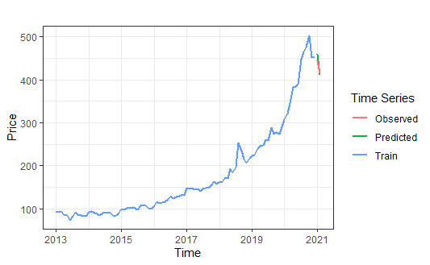

To satisfy that curiosity we mentioned at the very beginning of the  article, we will find the ratio that affects the target variable of each explanatory variable separately.

```R
#Feature importance
library(Ckmeans.1d.dp)
 
xgb_imp <- xgb.importance(
  feature_names = colnames(train_Dmatrix),
  model = model_xgb$finalModel)
 
xgb.ggplot.importance(xgb_imp,n_clusters = c(2))+ 
  ggtitle("") +
  theme_bw()+
  theme(legend.position="none")
 
xgb_imp$Importance
#[1] 0.92995147 0.07004853 
```

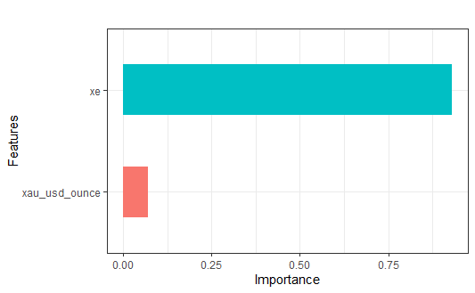

**Conclusion**

When we examine the above results and plot, contrary to popular  belief, it is seen that the exchange rate has a more dominant effect  than the price of ounce gold. In the next article, we will compare this  method with the dynamic regression ARIMA model.

***

Comment from reader:

A problem with using tree-based models (including xgboost) is that they  can’t extrapolate when the predictors are outside the range in the  training data (there are some examples of this e.g. in the exercises in http://www.modernstatisticswithr.com/mlchapter.html#boosted-trees). For instance, if you’d only included data up to 2019-12-31 in the  training set and then made predictions for 2020, the model wouldn’t  predict that the price would continue to increase (try it!). The  mobForest package could be a better option here – it fits a random  forest with a linear regression in each node, and so can handle  extrapolation.