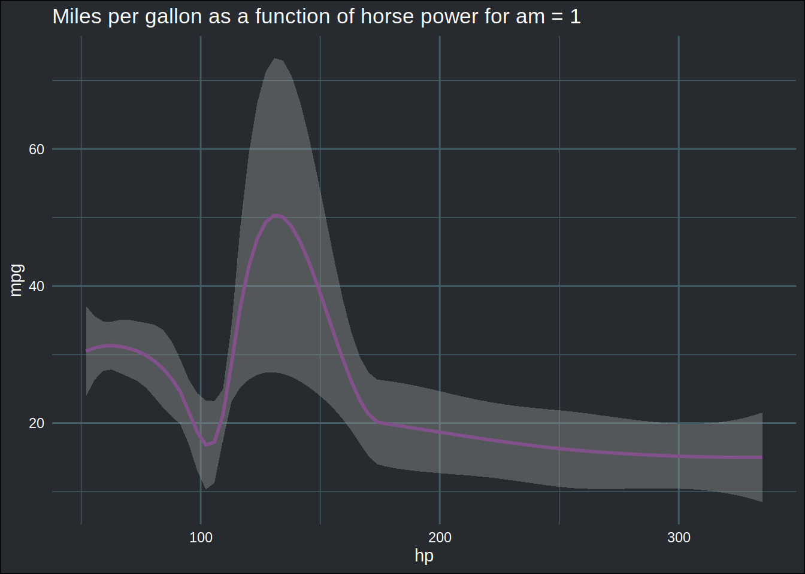

```{r setup, include=FALSE}
knitr::opts_chunk$set(echo = FALSE)
```

If you’ve been a faithful reader of this blog, or if you watch my [youtube channel](https://www.youtube.com/channel/UCTZXht1RTL2Duc3eU8MYGzQ) you’ve very likely seen me write code that looks like this:

```
library(tidyverse)
library(rlang)
library(tidyxl)
library(brotools)
mtcars_plot <- mtcars %>%
  group_nest(am) %>% #shortcut for group_by(am) %>% nest() 
  mutate(plots = map2(.y = am, .x = data, ~{ggplot(data = .x) +
                              geom_smooth(aes(y = mpg, x = hp), colour = "#82518c") +
                                ggtitle(paste0("Miles per gallon as a function of horse power for am = ", .y)) +
                                theme_blog()}))
```

This creates a new data frame that looks like this:

```
mtcars_plot
## # A tibble: 2 x 3
##      am           data plots 
##   <dbl> <list<tibble>> <list>
## 1     0      [19 × 10] <gg>  
## 2     1      [13 × 10] <gg>
```

In three lines of code, I grouped the `mtcars` dataframe by the variable `am` and then created two plots, which are contained in a new column called `plots`. If you’re unfamiliar with R, it is quite likely that you’ve never seen anything like this. If you have experience with functional programming languages though, you might recognize what’s going on. Essentially, `map2()` *loops* over two variables, `am` and `data` (this variable is not in the original data frame, but gets created as a result of the `group_nest(am)` call) and applies a function, in this case a call to `ggplot()`, to generate two plots… If you’ve never seen this before, I invite you to read the section dedicated to this type of workflows on my [ebook](https://b-rodrigues.github.io/modern_R/functional-programming.html#list-based-workflows-for-efficiency).

Let’s take a look at the plots:

```
mtcars_plot %>%
  pull(plots)
## [[1]]
## `geom_smooth()` using method = 'loess' and formula 'y ~ x'
```


```
## 
## [[2]]
## `geom_smooth()` using method = 'loess' and formula 'y ~ x'
```



The advantage of this workflow is that you don’t have to think much about anything -once you understand how it works-. The alternative would be two create two separate data frames, and create two separate plots. That’s a totally valid solution, unless you need to create hundreds of plots. With the workflow above, it doesn’t matter if the `am` variable has 2 or 2000 levels. The code would look exactly the same.

This workflow is very flexible. You can even use this approach to read in, and analyze, many, many files. As many as, for instance, 15931 Excel files from an American oil company that went bust in the early 2000’s, Enron.

# The Enron Corpus

I won’t go into much detail about the Enron Corpus, but to make a long story short: Big evil American oil company went bust, company emails got released for research purposes after being purchased for 10000USD by a computer scientist, and many of these emails had Excel spreadsheets attached to them. Other computer scientist released spreadsheets for research purposes. You can read the whole story on [Felienne Hermans’ blog](https://www.felienne.com/archives/3634) (read it, it’s quite interesting).

Anyways, you can now get this treasure trove of nightmarish Excel spreadsheets by clicking [here](https://figshare.com/articles/dataset/Enron_Spreadsheets_and_Emails/1221767) (this is the link provided in the blog post by Felienne Hermans). I already discussed this in a [previous blog post](https://www.brodrigues.co/blog/2020-11-21-guis_mistake/).

On Felienne Hermans’ blog post, you can spot the following table:


I’m going to show how this table could be replicated using R and the `mutate()`-`map()` workflow above.

First, let’s load one single spreadsheet with `{tidyxl}` and get some of the code ready that we will need. Let’s get all the paths to all the files in a vector:

```
list_paths <- list.files(path = "~/six_to/spreadsheets",
                         pattern = ".xlsx",
                         full.names = TRUE)
```

Let’s work with the first one. Let’s read it in with `{tidyxl}`:

```
(example_xlsx <- xlsx_cells(list_paths[1]))
## # A tibble: 19,859 x 21
##    sheet       address   row   col is_blank data_type error logical numeric
##    <chr>       <chr>   <int> <int> <lgl>    <chr>     <chr> <lgl>     <dbl>
##  1 Preschedule A1          1     1 FALSE    date      <NA>  NA           NA
##  2 Preschedule B1          1     2 TRUE     blank     <NA>  NA           NA
##  3 Preschedule C1          1     3 TRUE     blank     <NA>  NA           NA
##  4 Preschedule D1          1     4 TRUE     blank     <NA>  NA           NA
##  5 Preschedule E1          1     5 TRUE     blank     <NA>  NA           NA
##  6 Preschedule F1          1     6 TRUE     blank     <NA>  NA           NA
##  7 Preschedule G1          1     7 TRUE     blank     <NA>  NA           NA
##  8 Preschedule H1          1     8 TRUE     blank     <NA>  NA           NA
##  9 Preschedule I1          1     9 TRUE     blank     <NA>  NA           NA
## 10 Preschedule J1          1    10 TRUE     blank     <NA>  NA           NA
## # … with 19,849 more rows, and 12 more variables: date <dttm>, character <chr>,
## #   character_formatted <list>, formula <chr>, is_array <lgl>,
## #   formula_ref <chr>, formula_group <int>, comment <chr>, height <dbl>,
## #   width <dbl>, style_format <chr>, local_format_id <int>
```

The beauty of `{tidyxl}` is that it can read in a very complex and ugly Excel file without any issues. Each cell of the spreadsheet is going to be one row of the data set, the contents of all cells is now easily accessible. Let’s see how many sheets are in there:

```
example_xlsx %>%
  summarise(n_sheets = n_distinct(sheet))
## # A tibble: 1 x 1
##   n_sheets
##      <int>
## 1       11
```

11… that’s already quite a lot. How many formulas are there per sheet?

```
example_xlsx %>%
  mutate(is_formula = !is.na(formula)) %>%  
  group_by(sheet) %>%
  summarise(n_formula = sum(is_formula)) %>%
  arrange(desc(n_formula))
## # A tibble: 11 x 2
##    sheet                  n_formula
##    <chr>                      <int>
##  1 Preschedule                 2651
##  2 Deals                        324
##  3 Economics                    192
##  4 Balancing                     97
##  5 Fuel                          70
##  6 Comp                           0
##  7 EPEData                        0
##  8 HeatRate                       0
##  9 spin reserve log sheet         0
## 10 Top                            0
## 11 Unit Summary                   0
```

There’s a sheet in there with 2651 formulas. This is insane. Anyways, as you can see, `{tidyxl}` makes analyzing what’s inside such Excel files quite simple. Let’s now create functions that will compute what we need. I won’t recreate everything from the table, but you’ll very quickly get the idea. Let’s start with a function to count spreadsheets that contain at least one formula:

```
at_least_one_formula <- function(x){

  (any(!is.na(x$formula)))

}
```

Let’s get the number of worksheets:

```
n_sheets <- function(x){

  x %>%
    summarise(n_sheets =  n_distinct(sheet)) %>%
    pull(n_sheets)

}
```

And how many formulas are contained in a spreadsheet:

```
n_formulas <- function(x){

  x %>%
    mutate(is_formula = !is.na(formula)) %>%
    summarise(n_formula = sum(is_formula)) %>%
    pull(n_formula)

}
```

Let’s stop here. We could of course continue adding functions, but that’s enough to illustrate what’s coming. Let’s just define one last function. This function will call all three functions defined above, and return the result in a dataframe. You’ll see why soon enough:

```
get_stats <- function(x){

  tribble(~has_formula, ~n_sheets, ~n_formulas,
          at_least_one_formula(x), n_sheets(x), n_formulas(x))

}
```

Let’s try it out on our single spreadsheet:

```
get_stats(example_xlsx)
## # A tibble: 1 x 3
##   has_formula n_sheets n_formulas
##   <lgl>          <int>      <int>
## 1 TRUE              11       3334
```

Neat.

Now, let’s see how we can apply these function to 15k+ Excel spreadsheets.

# No loops ever allowed

10 years ago, I was confronted to a similar problem. I had a pretty huge amount of files on a computer that I needed to analyze for a chapter of my Phd thesis. The way I solved this issue was by writing a loop that looked horrible and did what I needed on each file. It did the job, but it did not look good, and was a nightmare whenever I needed to modify it, which I needed to do often. I had to think about a structure to hold the results; it was a nested list with I think 4 or 5 levels, and I had to keep track of the dimensions in my head to make sure I was writing the right result in the right spot. It wasn’t pleasant. Until this week, I thought that such a loop was the only real solution to such a problem.

But a comment on one of my youtube video changed this:


The comment was made on [this video](https://www.youtube.com/watch?v=vtxb1j0aqJM) in which I create a data set like in the introduction to this blog post, but instead of having 2 groups (and thus 2 datasets), I had 100. Now, in the video this wasn’t an issue, but what if instead of having 100 datasets, I had 15k+? And what if these datasets were quite huge? For example, the largest spreadsheet in the Enron Corpus is 40MiB. Loading it with `{tidyxl}` returns a tibble with 17 million rows, and needs 2GiB of RAM in a clean R session. If you want to read in all the 15k+, you’re simply going to run out of memory even before you could analyze anything. As I’ve written above, the solution would be to loop over each file, do whatever I need done, and save the results in some kind of structure (very likely some complex nested list). Or is it the only solution? Turns out that I tried some things out and found a solution that does not require changing my beloved `mutate()`-`map()` workflow.

Let’s first start by putting the paths in a data frame:

```
(enron <- enframe(list_paths, name = NULL, value = "paths"))
## # A tibble: 15,871 x 1
##    paths                                                                        
##    <chr>                                                                        
##  1 /home/cbrunos/six_to/spreadsheets/albert_meyers__1__1-25act.xlsx             
##  2 /home/cbrunos/six_to/spreadsheets/albert_meyers__2__1-29act.xlsx             
##  3 /home/cbrunos/six_to/spreadsheets/andrea_ring__10__ENRONGAS(1200).xlsx       
##  4 /home/cbrunos/six_to/spreadsheets/andrea_ring__11__ENRONGAS(0101).xlsx       
##  5 /home/cbrunos/six_to/spreadsheets/andrea_ring__12__ENRONGAS(1200).xlsx       
##  6 /home/cbrunos/six_to/spreadsheets/andrea_ring__13__Trader & Products 5-15-01…
##  7 /home/cbrunos/six_to/spreadsheets/andrea_ring__14__Trader & Products 5-16-01…
##  8 /home/cbrunos/six_to/spreadsheets/andrea_ring__15__IFERCnov.xlsx             
##  9 /home/cbrunos/six_to/spreadsheets/andrea_ring__16__ifercdec.xlsx             
## 10 /home/cbrunos/six_to/spreadsheets/andrea_ring__17__IFERCJan.xlsx             
## # … with 15,861 more rows
```

For the purposes of this blog post, let’s limit ourselves to 30 spreadsheets. This won’t impact how the code is going to work, nor memory usage. It’s just that I won’t my post to compile quickly while I’m writing:

```
(enron <- head(enron, 30)) 
## # A tibble: 30 x 1
##    paths                                                                        
##    <chr>                                                                        
##  1 /home/cbrunos/six_to/spreadsheets/albert_meyers__1__1-25act.xlsx             
##  2 /home/cbrunos/six_to/spreadsheets/albert_meyers__2__1-29act.xlsx             
##  3 /home/cbrunos/six_to/spreadsheets/andrea_ring__10__ENRONGAS(1200).xlsx       
##  4 /home/cbrunos/six_to/spreadsheets/andrea_ring__11__ENRONGAS(0101).xlsx       
##  5 /home/cbrunos/six_to/spreadsheets/andrea_ring__12__ENRONGAS(1200).xlsx       
##  6 /home/cbrunos/six_to/spreadsheets/andrea_ring__13__Trader & Products 5-15-01…
##  7 /home/cbrunos/six_to/spreadsheets/andrea_ring__14__Trader & Products 5-16-01…
##  8 /home/cbrunos/six_to/spreadsheets/andrea_ring__15__IFERCnov.xlsx             
##  9 /home/cbrunos/six_to/spreadsheets/andrea_ring__16__ifercdec.xlsx             
## 10 /home/cbrunos/six_to/spreadsheets/andrea_ring__17__IFERCJan.xlsx             
## # … with 20 more rows
```

Ok, so now, in order to read in all these files, I would write the following code:

```
enron %>%
  mutate(datasets = map(paths, xlsx_cells))
```

This would create a new column called `datasets` where each element would be a complete data set. If I run this in my 30 examples, it might be ok. But if I run it on the full thing, there’s no way I’m not going to run out of RAM. So how to solve this issue? How to run my neat `get_stats()` function on all datasets if I cannot read in the data? The solution is to only read in the data when I need it, and only one dataset at a time. The solution is to build a *lazy* tibble. And this is possible using `quo()`. To quickly grasp what `quo()` does, let’s try calling the following expression once with, and once without `quo()`:

```
runif(10)
##  [1] 0.98342755 0.13500737 0.06196822 0.61304269 0.30600919 0.48015570
##  [7] 0.05747049 0.04535318 0.37880304 0.70647563
```

This runs `runif(10)` returning 10 randomly generated numbers, as expected.

```
quo(unif(10))
## <quosure>
## expr: ^unif(10)
## env:  global
```

This instead returns a quosure, which to be honest, is a complex beast. I’m not sure I get it myself. The definition, is that quosures are *quoted expressions that keep track of an environment*. For our practical purposes, we can use that to delay when the data gets read in, and that’s all that matters:

```
(enron <- enron %>%
   mutate(datasets = map(paths, ~quo(xlsx_cells(.)))))
## # A tibble: 30 x 2
##    paths                                                                datasets
##    <chr>                                                                <list>  
##  1 /home/cbrunos/six_to/spreadsheets/albert_meyers__1__1-25act.xlsx     <quosur…
##  2 /home/cbrunos/six_to/spreadsheets/albert_meyers__2__1-29act.xlsx     <quosur…
##  3 /home/cbrunos/six_to/spreadsheets/andrea_ring__10__ENRONGAS(1200).x… <quosur…
##  4 /home/cbrunos/six_to/spreadsheets/andrea_ring__11__ENRONGAS(0101).x… <quosur…
##  5 /home/cbrunos/six_to/spreadsheets/andrea_ring__12__ENRONGAS(1200).x… <quosur…
##  6 /home/cbrunos/six_to/spreadsheets/andrea_ring__13__Trader & Product… <quosur…
##  7 /home/cbrunos/six_to/spreadsheets/andrea_ring__14__Trader & Product… <quosur…
##  8 /home/cbrunos/six_to/spreadsheets/andrea_ring__15__IFERCnov.xlsx     <quosur…
##  9 /home/cbrunos/six_to/spreadsheets/andrea_ring__16__ifercdec.xlsx     <quosur…
## 10 /home/cbrunos/six_to/spreadsheets/andrea_ring__17__IFERCJan.xlsx     <quosur…
## # … with 20 more rows
```

This takes less than a second to run, and not just because I only have 30 paths. Even if I was working on the complete 15k+ datasets, this would run in an instant. That’s because we’re actually not reading in anything yet. We’re only setting the scene.

The magic happens now: we’re going to now map our function that computes the stats we need. We only need to change one thing. Let’s see:

```
get_stats <- function(x){

  x <- eval_tidy(x)

  tribble(~has_formula, ~n_sheets, ~n_formulas,
          at_least_one_formula(x), n_sheets(x), n_formulas(x))

}
```

I’ve added this line:

```
x <- eval_tidy(x)
```

This evaluates the quosure, thus instantiating the dataset, and then proceeds to make all the computations. Let’s see what happens when we run this on our lazy tibble:

```
(enron <- enron %>%
   mutate(stats = map(datasets, get_stats)))
## # A tibble: 30 x 3
##    paths                                                  datasets  stats       
##    <chr>                                                  <list>    <list>      
##  1 /home/cbrunos/six_to/spreadsheets/albert_meyers__1__1… <quosure> <tibble [1 …
##  2 /home/cbrunos/six_to/spreadsheets/albert_meyers__2__1… <quosure> <tibble [1 …
##  3 /home/cbrunos/six_to/spreadsheets/andrea_ring__10__EN… <quosure> <tibble [1 …
##  4 /home/cbrunos/six_to/spreadsheets/andrea_ring__11__EN… <quosure> <tibble [1 …
##  5 /home/cbrunos/six_to/spreadsheets/andrea_ring__12__EN… <quosure> <tibble [1 …
##  6 /home/cbrunos/six_to/spreadsheets/andrea_ring__13__Tr… <quosure> <tibble [1 …
##  7 /home/cbrunos/six_to/spreadsheets/andrea_ring__14__Tr… <quosure> <tibble [1 …
##  8 /home/cbrunos/six_to/spreadsheets/andrea_ring__15__IF… <quosure> <tibble [1 …
##  9 /home/cbrunos/six_to/spreadsheets/andrea_ring__16__if… <quosure> <tibble [1 …
## 10 /home/cbrunos/six_to/spreadsheets/andrea_ring__17__IF… <quosure> <tibble [1 …
## # … with 20 more rows
```

What happened here is nothing short of black magic: one by one, each quosure was instantiated, and the required stats were computed, then the dataset was thrown into the garbage before moving on to the next quosure. This means that RAM usage was kept to a minimum, and I could have run this over my 15k+ spreadsheets without any issue. You can watch me run similar code in my video [here](https://youtu.be/DERMZi3Ck20?t=820); I show how my RAM usage does not move even though I’m mapping over all the Excel sheets. The column `stats` now holds one dataframe with one row and three columns for each Excel file. Because `stats` is a list-column of dataframes, we can use `unnest()` to get to the data. Let’s take a closer look on one dataframe:

```
enron %>%
  head(1) %>%
  select(paths, stats) %>%
  unnest(cols = stats)
## # A tibble: 1 x 4
##   paths                                          has_formula n_sheets n_formulas
##   <chr>                                          <lgl>          <int>      <int>
## 1 /home/cbrunos/six_to/spreadsheets/albert_meye… TRUE              11       3334
```

We see that by using `unnest()`, the two columns inside the nested dataframe get expanded and become columns of the “main” dataframe.

We’re done, but let’s clean up the dataset a little bit and take a look at the results:

```
(
  enron <- enron %>%
    mutate(excel_file = str_remove(paths, "/home/cbrunos/six_to/spreadsheets/")) %>%
    select(-paths, -datasets) %>%
    unnest(cols = stats)
)
## # A tibble: 30 x 4
##    has_formula n_sheets n_formulas excel_file                                   
##    <lgl>          <int>      <int> <chr>                                        
##  1 TRUE              11       3334 albert_meyers__1__1-25act.xlsx               
##  2 TRUE              11       3361 albert_meyers__2__1-29act.xlsx               
##  3 TRUE               4        550 andrea_ring__10__ENRONGAS(1200).xlsx         
##  4 TRUE               4        549 andrea_ring__11__ENRONGAS(0101).xlsx         
##  5 TRUE               4        550 andrea_ring__12__ENRONGAS(1200).xlsx         
##  6 FALSE              0          0 andrea_ring__13__Trader & Products 5-15-01 E…
##  7 FALSE              0          0 andrea_ring__14__Trader & Products 5-16-01 E…
##  8 TRUE               1        169 andrea_ring__15__IFERCnov.xlsx               
##  9 TRUE               1        177 andrea_ring__16__ifercdec.xlsx               
## 10 TRUE               1        162 andrea_ring__17__IFERCJan.xlsx               
## # … with 20 more rows
```

Getting some statistics is now easy:

```
enron %>%
  summarise(average_n_formulas = mean(n_formulas),
            max_sheets = max(n_sheets))
## # A tibble: 1 x 2
##   average_n_formulas max_sheets
##                <dbl>      <int>
## 1               490.         11
```

By the way, now that we see that the code works, we can run it on all the spreadsheets simply by not running the following line:

```
(enron <- head(enron, 30)) 
```

Also, we can quite easily run all of this in parallel using `{furrr}`:

```
library(furrr)
## Loading required package: future
plan(multiprocess, workers = 12)

enron <- enframe(list_paths, name = NULL, value = "paths")

enron <- head(enron, 1200) #just to compile the document faster, I only consider 1200 Excel spreadsheets

enron <- enron %>%
   mutate(datasets = map(paths, ~quo(xlsx_cells(.))))

start <- Sys.time()
enron <- enron %>%
  mutate(stats = future_map(datasets, get_stats))
Sys.time() - start
## Time difference of 36.86839 secs
```

Same code, no parallelization (it takes longer, obviously):

```
enron <- enframe(list_paths, name = NULL, value = "paths")

enron <- head(enron, 1200)

enron <- enron %>%
   mutate(datasets = map(paths, ~quo(xlsx_cells(.))))

start <- Sys.time()
enron <- enron %>%
  mutate(stats = map(datasets, get_stats))
Sys.time() - start
## Time difference of 1.217199 mins
```

I think this is pretty neat.