```{r setup, include=FALSE}
knitr::opts_chunk$set(echo = FALSE)
```

When working with geospatial data, memory consumption and computation time can become quite a problem, since these datasets are often very  large. You may have very granular, high resolution data although that  isn’t really necessary for your use-case, for example when plotting  large scale maps or when applying calculations at a spatial level for  which lower granularity is sufficient. In such scenarios, it’s best to  first *simplify* the *geospatial features* (the sets of  points, lines and polygons that represent geographic entities) in your  data. By simplify I mean that we generally reduce the amount of  information that is used to represent these features, i.e. we remove  complete features (e.g. small islands), we join features (e.g. we  combine several overlapping or adjacent features) or we reduce the  complexity of features (e.g. we remove vertices or holes in a feature).  Since applying these operations comes with information loss you should  be very careful about how much you simplify and if this in some way  biases you results.

In R, we can apply this sort of simplification with a few functions from the packages [sf](https://cran.r-project.org/web/packages/sf/index.html) and, for some special cases explained below, [rmapshaper](https://cran.r-project.org/web/packages/rmapshaper/index.html). In the following, I will show how to apply them and what the effects of their parameters are. The data and source code are [available on GitHub](https://github.com/WZBSocialScienceCenter/r_simplify_features).


First, let’s load the required libraries. Besides the already mentioned sf package, we also load [ggplot2](https://ggplot2.tidyverse.org/) for visualization and [magrittr](https://magrittr.tidyverse.org/), because I will use the `%>%` pipe operator sometimes.

```
library(ggplot2)
library(magrittr)
library(sf)
```

I will also use a utility function `plot_map()` which is  capable of plotting geospatial features, zooming into certain spots and  highlighting differences between two features. The lengthy source code  for this function is available in the [Rmarkdown document of the related GitHub repository](https://github.com/WZBSocialScienceCenter/r_simplify_features).

## Loading and transforming our sample data

Let’s load our first example dataset. It represents the German federal state [Mecklenburg-Vorpommern (or Mecklenburg-West Pomerania)](https://www.openstreetmap.org/relation/28322) that features a ragged coastline at the Baltic Sea, which is nice to  show the effects of feature simplification. I will abbreviate  Mecklenburg-Vorpommern by MV to spare us the complicated name.

```
mv <- st_read('data/mv.geojson') %>%
  st_geometry() %>%
  st_transform(crs = '+proj=aeqd +lat_0=53.6 +lon_0=12.7')
    # centered at input data for low distortion
```

The dataset contains only a single feature (a multi-polygon, i.e. a  set of polygons) with some metadata from OpenStreetMap. I use `st_geometry` to access this feature (i.e. dismiss the metadata) and `st_transform` to transform it to an [Azimuthal Equidistant](http://www.radicalcartography.net/?projectionref) map projection. The latter is quite important. Most functions that I’ll use don’t work with spherical coordinates as used for example by the [WGS84 (GPS) standard](http://epsg.io/4326), where longitude and latitude in degrees describe a position on a  sphere. We need to project these coordinates on a plane using a  coordinate reference system (CRS) with a specific projection. All  projections distort in some way, but we can choose a CRS that accurately represents certain measures. For example, I chose an equidistant CRS  because it accurately represents distances up to 10,000 km from the  center of projection. Another important aspect is that by using this  CRS, we move from degrees to meters as units for our coordinates.

Let’s plot our projection of MV. Note the axes which represent the  distance from the projection center (I chose the geographic center of MV for that) in meters.

```
plot_map(mv, graticules = TRUE)
```

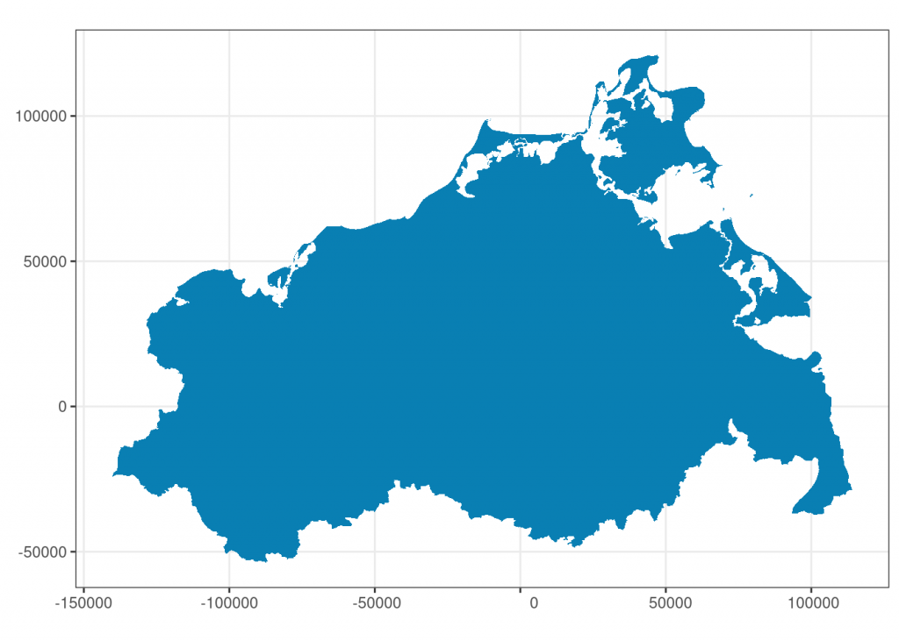

Let’s zoom in on the island of Rügen with it’s ragged coastline (west of it is the peninsula Darß, east is a part of Usedom).

```
plot_map(mv, graticules = TRUE, zoom_to = c(13.359, 54.413), 
         zoom_level = 8)
```

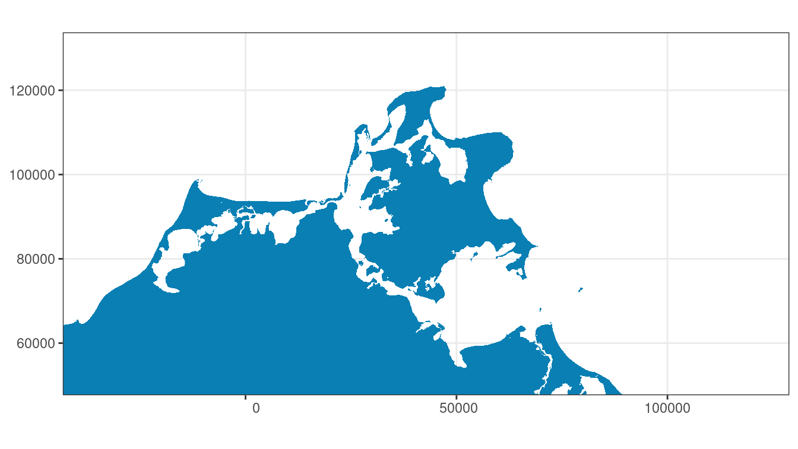

## Removing vertices with `st_simplify`

We can now continue to apply different simplification methods to the displayed features. We will start with – no surprise – [`st_simplify`](https://rdrr.io/cran/sf/man/geos_unary.html). This function removes vertices in lines or polygons to form simpler shapes. The function implementation uses the [Douglas–Peucker algorithm](https://en.wikipedia.org/wiki/Ramer–Douglas–Peucker_algorithm) for simplification and accepts a parameter `dTolerance`, which roughly speaking specifies the distance in which any “wiggles”  will be straightened. It’s in the same unit as the input data, so in our case it’s meters (the unit used in our CRS). There’s also a parameter `preserveTopology` which, when set to TRUE, makes sure that polygons are not reduced to  lines or even removed, or that inner holes in them are removed during  the simplification process.

Let’s apply `st_simplify` with a tolerance of 1km:

```
mv_simpl <- st_simplify(mv, preserveTopology = FALSE, dTolerance = 1000)
plot_map(mv_simpl)
```

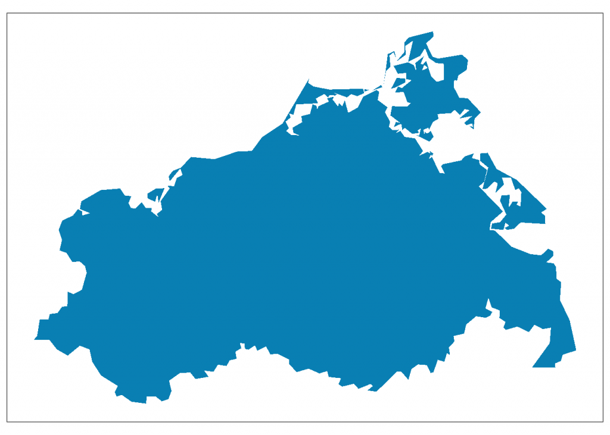

We can see that the geometry is much simpler, especially when zooming in:

```
plot_map(mv_simpl, zoom_to = c(13.359, 54.413), zoom_level = 8)
```

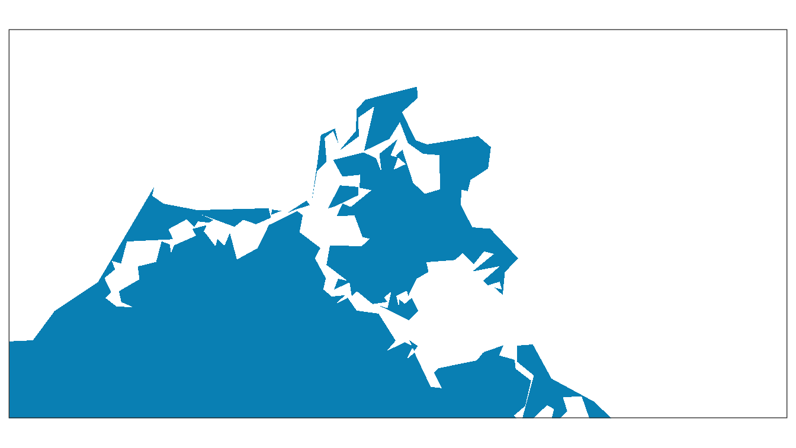

We can also confirm the memory usage is much lower for the simplified feature (shown in kilobytes):

```
round(c(object.size(mv), object.size(mv_simpl)) / 1024)
[1] 960  13
```

The purple areas show the differences between the original and the  simplified version. We can see for example, that some smaller islands  were completely removed.

```
plot_map(mv, mv_simpl, zoom_to = c(13.359, 54.413),
         zoom_level = 8)
```

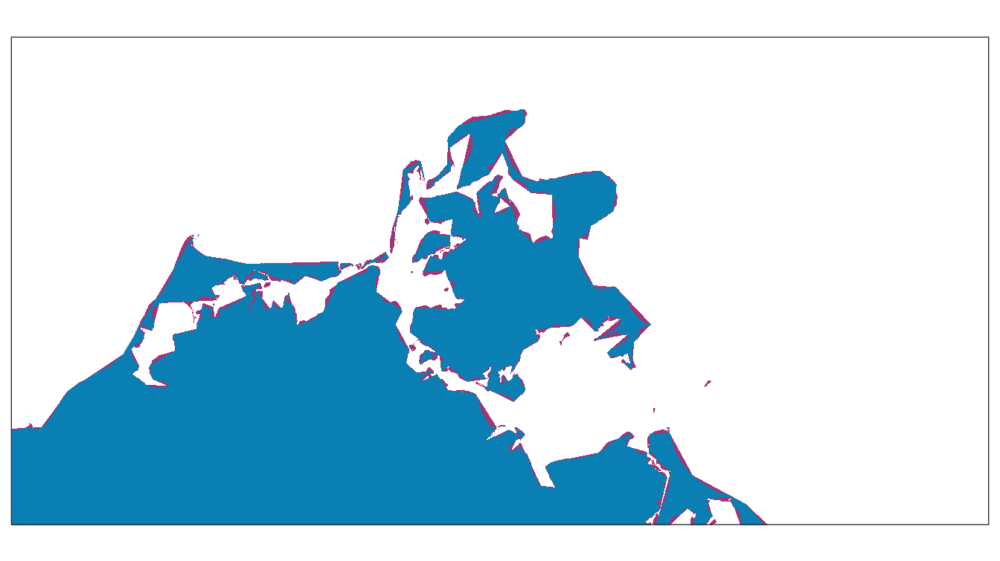

When we set `preserveTopology` to TRUE, we can observe that the small islands are retained:

```
mv_simpl <- st_simplify(mv, preserveTopology = TRUE,
                        dTolerance = 1000)
plot_map(mv_simpl, zoom_to = c(13.359, 54.413), zoom_level = 8)
```


Increasing the `dTolerance` parameter to 10km gives us something that is more akin to a Cubistic painting:

```
mv_simpl <- st_simplify(mv, preserveTopology = FALSE, 
                        dTolerance = 10000)
plot_map(mv_simpl)
```


```
plot_map(mv, mv_simpl)
```

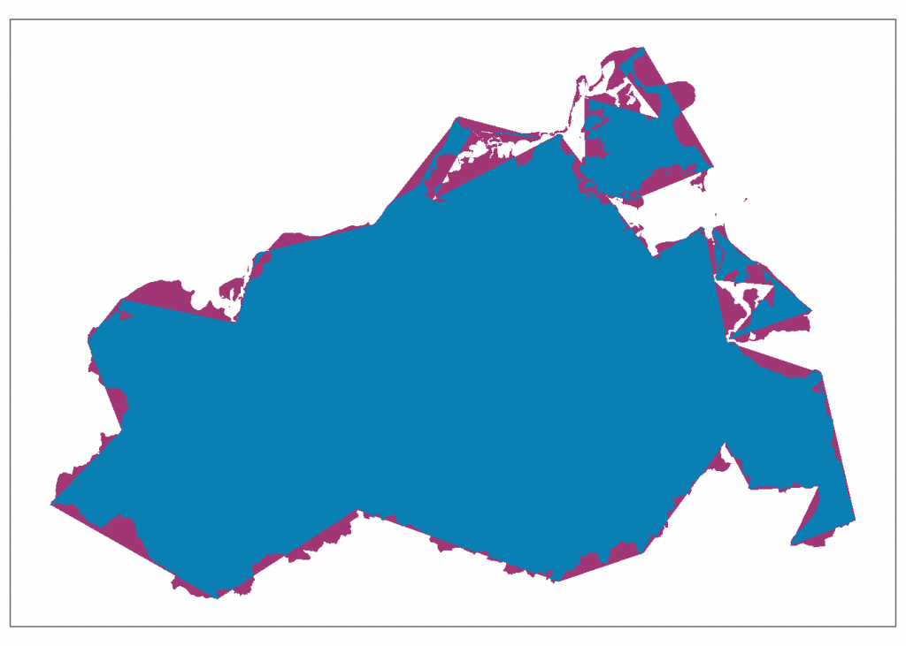

## `st_simplify` limitations

Using `st_simplify` comes with a limitation when working  with multiple, adjacent features which I’d like to demonstrate using a  map of the federal states in Germany.

```
fedstates <- read_sf('data/germany_fedstates.geojson') %>%
  st_transform(crs = 5243)  # ETRS89 / LCC Germany (E-N)
fedstates[c('name', 'geometry')]
## Simple feature collection with 16 features and 1 field
## geometry type:  MULTIPOLYGON
…
## projected CRS:  ETRS89 / LCC Germany (E-N)
## # A tibble: 16 x 2
…
##  1 Baden-Württemberg (((-112269.7 -363339.8, …
##  2 Bavaria           (((-109036.3 -104479.2, …
##  3 Berlin            (((175933 160909.2, …
…
```

This time, our spatial dataset contains 16 features which represent the boundaries of each federal state:

```
plot_map(fedstates, graticules = TRUE, strokecolor = '#097FB3',
         fillcolor = '#AED3E4')
```

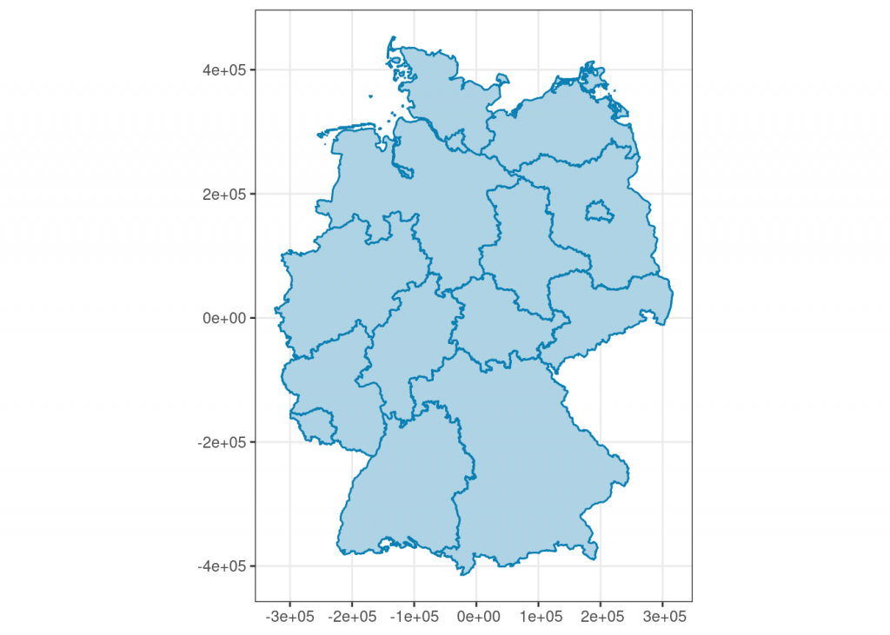

Let’s apply `st_simplify` with a tolerance of 10km and preserving feature topology:

```
fedstates_simpl <- st_simplify(fedstates,
                               preserveTopology = TRUE, 
                               dTolerance = 10000)
plot_map(fedstates_simpl, strokecolor = '#097FB3',
         fillcolor = '#AED3E4')
```


Ups! We can see that `st_simplify` produced gaps and overlapping features, i.e. shared borders were not handled correctly! The problem is that `st_simplify` simply doesn’t consider the topological concept of shared borders  between features (like federal states in this case). When setting `preserveTopology = TRUE` it means that each feature’s topology is preserved, but it doesn’t mean that the topology *between* features is considered.

Luckily, there’s the package [rmapshaper](https://cran.r-project.org/web/packages/rmapshaper/index.html) that contains a function that does the trick. Before you install the  package, please note that it requires a lot of (system-) dependencies to be installed.

[Visvalingam’s algorithm](https://en.wikipedia.org/wiki/Visvalingam–Whyatt_algorithm), which is used in this function, let’s us specify the portion of  vertices that should be kept after simplification. This can be specified with the `keep` parameter. The parameter `keep_shapes` controls whether complete features such as islands can be removed in the simplification process.

```
library(rmapshaper)

fedstates_simpl2 <- ms_simplify(fedstates, keep = 0.001,
                                keep_shapes = FALSE)
plot_map(fedstates_simpl2, strokecolor = '#097FB3',
         fillcolor = '#AED3E4')
```

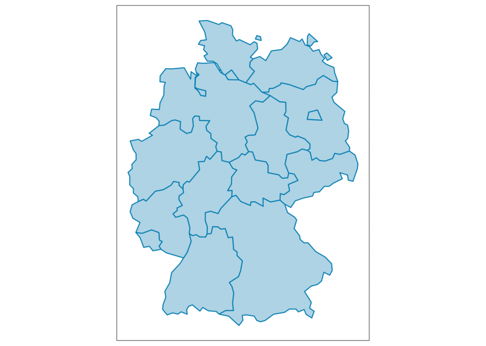

As can be seen, `ms_simplify` respects the shared borders. The result is also much smaller in terms of memory usage:

```
round(c(object.size(fedstates),
        object.size(fedstates_simpl2)) / 1024)
[1] 7757   71
```

## Expanding and shrinking with `st_buffer`

[`st_buffer`](https://rdrr.io/cran/sf/man/geos_unary.html) lets you expand (positive buffer distance) or shrink (negative buffer  distance) polygon features. This may not per-se result in a simpler  feature form, but it allows you to close holes (by expanding) or remove  solitary, small features (by shrinking).

Let’s try a first example. Again, the buffer distance is in the same  unit as our CRS, which is meters in our case, and we’ll expand by 1km.  When the buffer is generated, new vertices are added to form the  expanded shape with round edges. The parameter `nQuadSegs` specifies how many segments are generated per quadrant and feature.

```
mv_buf <- st_buffer(mv, dist = 1000, nQuadSegs = 1)
plot_map(mv_buf, graticules = TRUE)
```

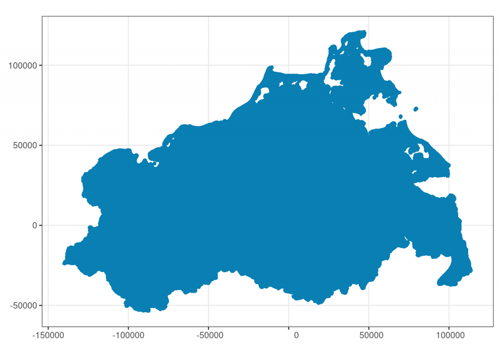

```
plot_map(mv, mv_buf, graticules = TRUE,
         zoom_to = c(13.359, 54.413), zoom_level = 8)
```

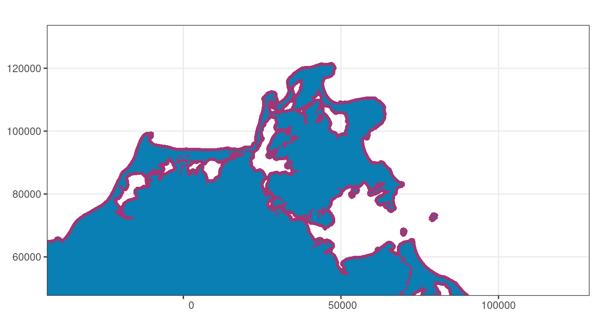

The memory usage is not so much reduced:

```
round(c(object.size(mv), object.size(mv_buf)) / 1024)
[1] 960 265
```

Now we shrink MV by 1km:

```
mv_buf <- st_buffer(mv, -1000, nQuadSegs = 1)
plot_map(mv_buf)
```

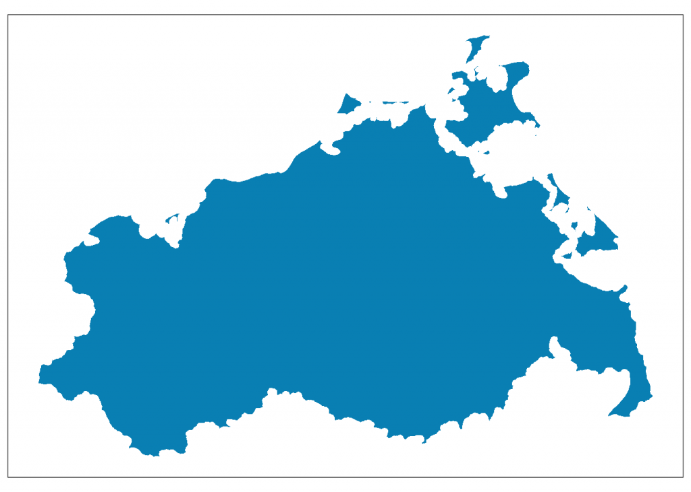

```
plot_map(mv, mv_buf, zoom_to = c(13.359, 54.413),
         zoom_level = 8)
```

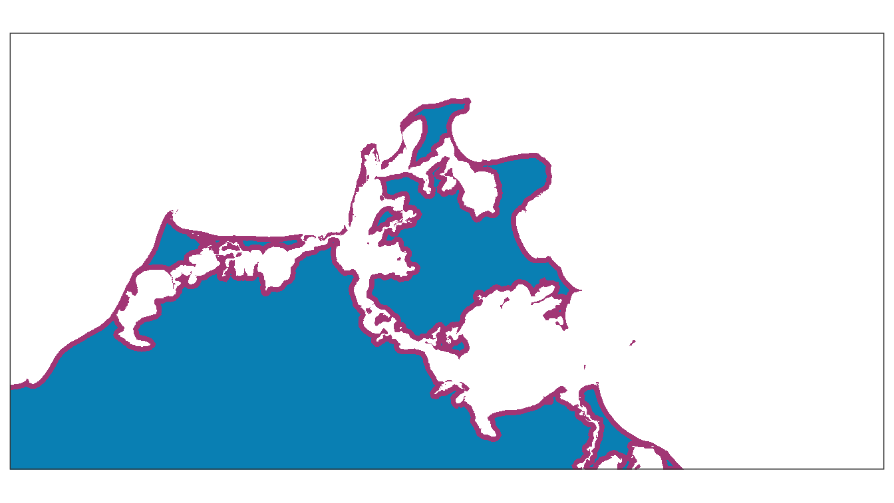

We can also combine both buffering options, by first shrinking in  order to remove small isolated features and then expanding again by the  same distance so that the result has more or less the same extents as  the original:

```
mv_buf <- st_buffer(mv, -1000, nQuadSegs = 1) %>%
  st_buffer(1000, nQuadSegs = 1)
plot_map(mv_buf)
```


```
plot_map(mv, mv_buf, zoom_to = c(13.359, 54.413),
         zoom_level = 8)
```

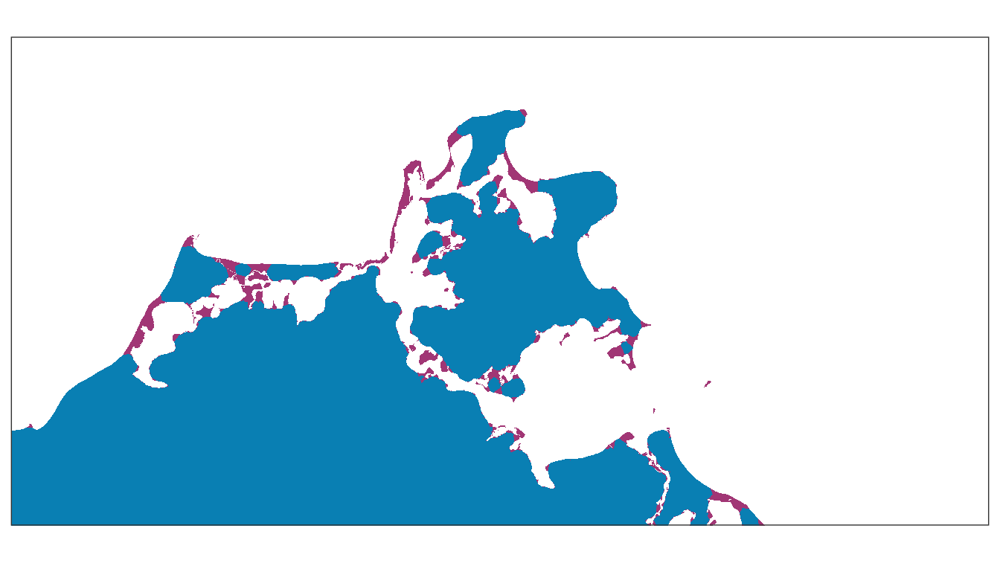

Note how this is more aggressive than `st_simplify` but the result uses more memory. We could now additionally apply `st_simplify` to arrive at a very reduced feature.

```
round(c(object.size(mv), object.size(mv_buf)) / 1024)
[1] 960 239
```

When we apply `st_buffer` to a dataset with multiple  features like the federal states dataset, the buffering will be applied  to every feature (i.e. every state’s boundary) separately. This will  result in either overlapping features (extending) or gaps between them  (shrinking).

## Joining overlapping and adjacent features with `st_union`

The last function that we will look at is `st_union`. It  can be used to join overlapping and adjacent features. With this, we  could for example join all features of the federal state boundaries in  Germany and get a single feature that represents the national  boundaries. But let’s look at a more interesting example and load a new  dataset. It contains a sample with regions with street noise of 50dB or  more in Berlin at night.

```
noise <- read_sf('data/noise_berlin_sample.geojson') %>%
  st_transform('+proj=aeqd +lat_0=52.51883 +lon_0=13.41537')

plot_map(noise, graticules = TRUE)
```

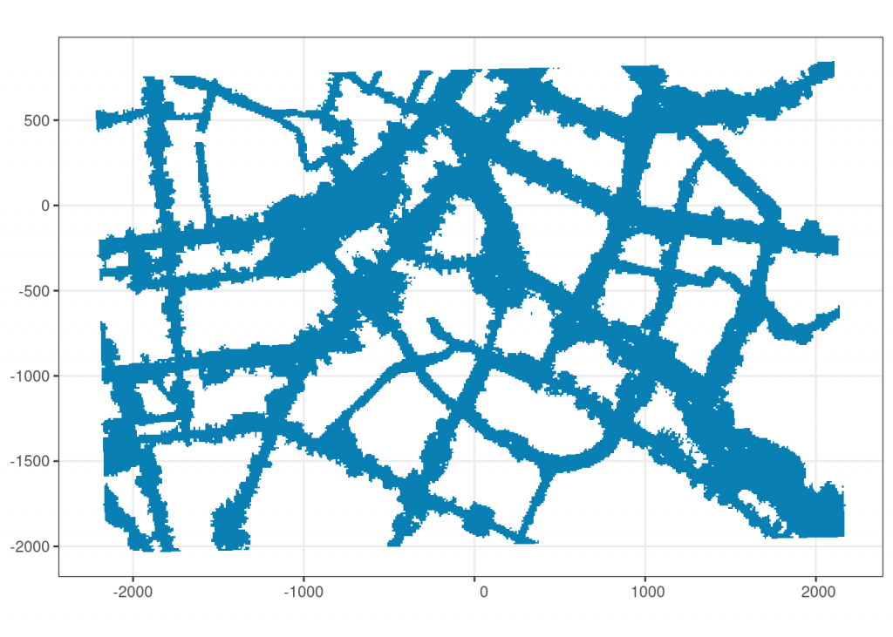

You may notice the ragged edges in the picture above. Furthermore,  the dataset is quite large and contains a lot of rows (i.e. features):

```
nrow(noise)
[1] 48795
```

Why is that so? When we zoom in and also plot each feature’s  boundary, we will notice that we actually have some sort of vectorized  raster data! The noise regions are tiny raster cells:

```
plot_map(noise, strokecolor = '#097FB3', fillcolor = '#AED3E4',
         zoom_level = 15)
```

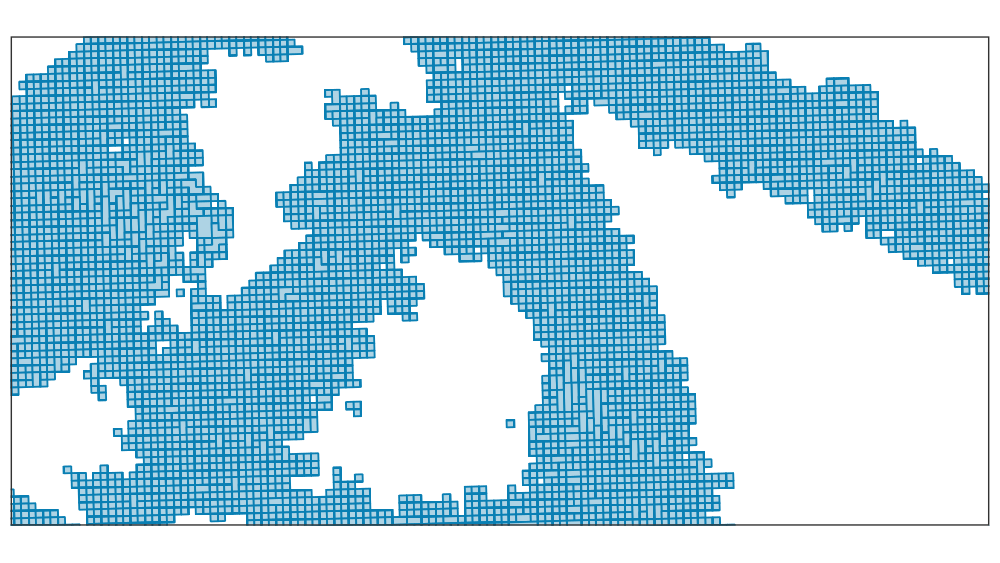

Most cells cover 100m² and come along with the noise level at this spot (`L_N` column):

```
summary(noise[c('Shape_Area', 'L_N')])
  Shape_Area         L_N                 geometry    
  Min.   :100.0   Min.   :50.00   MULTIPOLYGON :48795  
  1st Qu.:100.0   1st Qu.:54.10   epsg:NA      :    0  
  Median :100.0   Median :58.50   +proj=aeqd…:    0  
  Mean   :105.1   Mean   :59.12                        
  3rd Qu.:100.0   3rd Qu.:63.80                        
  Max.   :700.0   Max.   :75.40  
```

If we don’t care for the specific noise levels and only want to form a single feature that represents noise levels with 50dB or more, we can  apply `st_union` on the whole dataset:

```
noise_union <- st_union(noise)
noise_union
Geometry set for 1 feature 
 geometry type:  MULTIPOLYGON
 dimension:      XY
 bbox:           xmin: -2218.35 ymin: -2035.134
                 xmax: 2174.847 ymax: 845.1362
 CRS:            +proj=aeqd +lat_0=52.51883 +lon_0=13.41537
 MULTIPOLYGON (((-1931.274 -2034.915, -1941.274 …
```

As we can see in the output above, only a single feature is left (and all feature-specific “metadata” such as level of noise is gone!). We  can confirm this visually:

```
plot_map(noise_union, strokecolor = '#097FB3',
         fillcolor = '#AED3E4', zoom_level = 15)
```

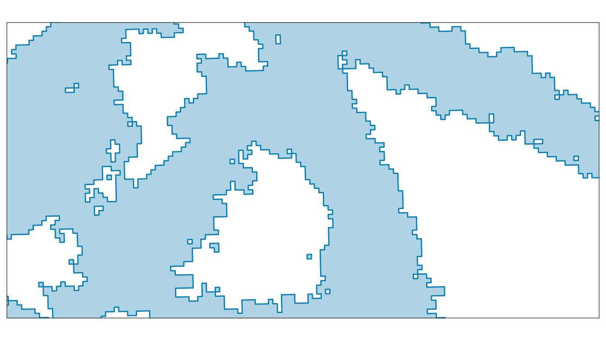

```
plot_map(noise_union, strokecolor = '#097FB3',
         fillcolor = '#AED3E4')
```

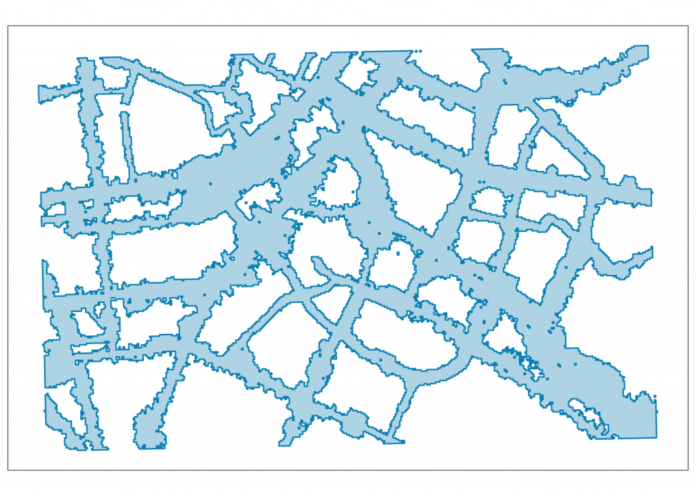

Additionally applying `st_simplify` removes the ragged edges:

```
noise_union_simpl <- st_simplify(noise_union,
                                 preserveTopology = FALSE, 
                                 dTolerance = 50)
plot_map(noise_union_simpl, strokecolor = '#097FB3',
         fillcolor = '#AED3E4')
```

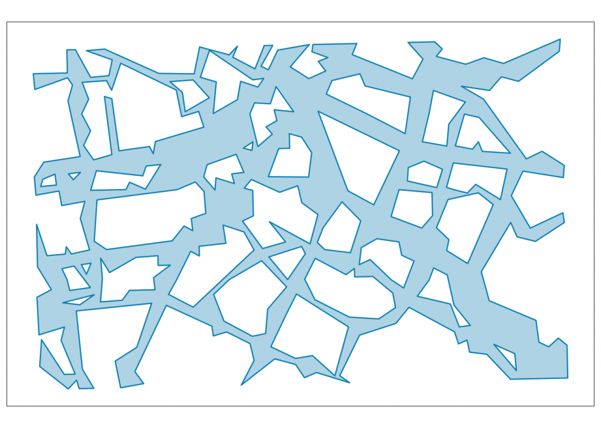

Note how much the memory consumption was reduced from initially 42 *mega*bytes to 282 *kilo*bytes or even 18 kilobytes when further simplified:

```
round(c(object.size(noise), object.size(noise_union),
        object.size(noise_union_simpl)) / 1024)
[1] 41959   282    18
```

Applying simplify without union before would not have had the desired effect since `st_simplify` is performed per feature:

```
st_simplify(noise, preserveTopology = FALSE,
            dTolerance = 10) %>%
  plot_map(strokecolor = '#097FB3', fillcolor = '#AED3E4')
```

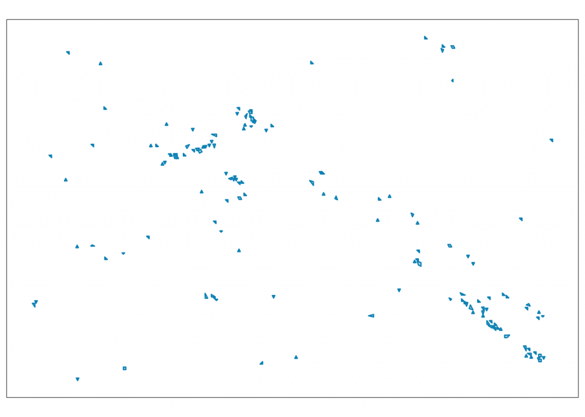

If we want to retain some of the noise level information, we can  quantize (“bin”) the noise level data into different ordered categories  and apply the union operation per category. I’m used to the [dplyr](https://dplyr.tidyverse.org/) package, so I’ll first create a quantized version of the noise variable `L_N` with three equally spaced levels between 50dB and 80dB and then use `group_by` in conjunction with `group_modify`:

```
library(dplyr)

noise_per_lvl <-
  mutate(noise,
         level = cut(L_N,
                     breaks = seq(50, 80, by = 10),
                     right = FALSE,
                     ordered_result = TRUE)) %>%
  group_by(level) %>%  # ".x" is refers to the current group:
  group_modify(~ st_union(.x) %>% as_tibble()) %>%
  ungroup() %>%
  st_as_sf()      # convert back to "sf" object since this 
                  # information is lost during group_by()
noise_per_lvl
## Simple feature collection with 3 features and 1 field
## geometry type:  MULTIPOLYGON
## dimension:      XY
## bbox:           xmin: -2218.35 ymin: -2035.134…
## CRS:            +proj=aeqd +lat_0=52.51883… 
## # A tibble: 3 x 2
##   level   geometry
## 1 [50,60) (((1908.792 -1950.634, 1898.792 -1950.854…
## 2 [60,70) (((1758.789 -1953.926, 1748.789 -1954.146…
## 3 [70,80) (((-527.0325 -373.2836, -537.0327 -373.50…
```

Again, the result is much smaller in terms of memory:

```
round(c(object.size(noise), object.size(noise_per_lvl)) / 1024)
[1] 41959  1090
```

The following gives us a plot with the three noise levels:

```
ggplot(noise_per_lvl) +
  geom_sf(aes(color = level, fill = level)) +
  coord_sf(datum = NA) +
  theme_bw()
```

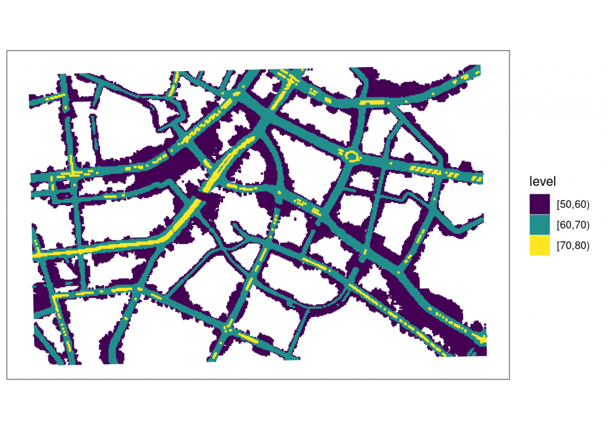

## Conclusion

All in all, it’s wise to first think about simplifying your spatial  data before you continue to work with it. Spatial datasets are often  very large and depending on your use-case you may not need a high level  of detail. It may even be absolutely necessary to reduce the complexity  of your data, e.g. when the computational capacities are limited or when you produce interactive maps for the web. As shown, R has all the tools that you need to simplify spatial data with the packages sf and  rmapshaper.


