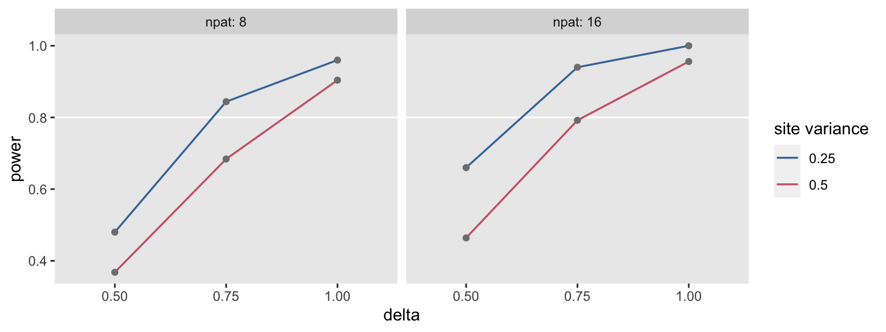

The [simstudy](https://kgoldfeld.github.io/simstudy/index.html) package started as a collection of functions I developed as I found  myself repeating many of the same types of simulations for different  projects. It was a way of organizing my work that I decided to share  with others in case they wanted a routine way to generate data as well. `simstudy` has expanded a bit from that, but replicability is still a key motivation.

What I have here is another attempt to document and organize a  process that I find myself doing quite often - repeated data generation  and model fitting. Whether I am conducting a power analysis using  simulation or exploring operating characteristics of different models, I take a pretty similar approach. I refer to this structure when I am  starting a new project, so I thought it would be nice to have it easily  accessible online - and that way others might be able to refer to it as  well.

### The framework

I will provide a simple application below, but first I’ll show the  general structure. The basic idea is that we want to generate data under a variety of assumptions - for example, a power analysis will assume  different sample sizes, effects, and/or levels of variation - and for *each set of assumptions*, we want to generate a large number of replications to mimic repeated  sampling from a population. The key elements of the process include (1) *defining* the data, (2) *generating* a data set, (3) *fitting a model* to the data, and (4) *providing summary statistics*.

If you have familiarity with `simstudy`, I’d say the code is pretty self-explanatory. In the function `s_generate`, there is a call to base R function `list2env`, which makes all elements of a list available as variables in the  function’s environment. The replication process is managed by the `mclapply` function from the `parallel` package. (Alternative approaches include using function `lapply` in base R or using a *for* loop.)

```
s_define <- function() {
  
  #--- add data definition code ---#
  
  return(list_of_defs) # list_of_defs is a list of simstudy data definitions
}

s_generate <- function(list_of_defs, argsvec) {
  
  list2env(list_of_defs, envir = environment())
  list2env(as.list(argsvec), envir = environment())
  
  #--- add data generation code ---#
  
  return(generated_data) #  generated_data is a data.table
}

s_model <- function(generated_data) {
  
  #--- add model code ---#
  
  return(model_results) # model_results is a data.table
}

s_single_rep <- function(list_of_defs, argsvec) {
  
  generated_data <- s_generate(list_of_defs, argsvec)
  model_results <- s_model(generated_data)
  
  return(model_results)
}

s_replicate <- function(argsvec, nsim) {
  
  list_of_defs <- s_define()

  model_results <- rbindlist(
    parallel::mclapply(
      X = 1 : nsim, 
      FUN = function(x) s_single_rep(list_of_defs, argsvec), 
      mc.cores = 4)
  )
  
  #--- add summary statistics code ---#
  
  return(summary_stats) # summary_stats is a data.table
}
```

#### Specifying scenarios

The possible values of each data generating parameter are specified as a vector. The function `scenario_list` creates all possible combinations of the values of the various parameters, so that there will be n1×n2×n3×...n_1 \times n_2 \times n_3 \times ...n1×n2×n3×... scenarios, where nin_ini is the number of possible values for parameter iii. Examples of parameters might be sample size, effect size, variance,  etc, really any value that can be used in the data generation process.

The process of data generation and model fitting is executed for each combination of n1×n2×n3×...n_1 \times n_2 \times n_3 \times ...n1×n2×n3×... scenarios. This can be done locally using function `lapply` or using a high performance computing environment using something like `Slurm_lapply` in the `slurmR` package. (I won’t provide an example of that here - let me know if you’d like to see that.)

```
#---- specify varying power-related parameters ---#

scenario_list <- function(...) {
  argmat <- expand.grid(...)
  return(asplit(argmat, MARGIN = 1))
}

param_1 <- c(...)
param_2 <- c(...)
param_3 <- c(...)
.
.
.

scenarios <- scenario_list(param1 = param_1, param_2 = param_2, param_3 = param_3, ...)

#--- run locally ---#

summary_stats <- rbindlist(lapply(scenarios, function(a) s_replicate(a, nsim = 1000)))
```

## Example: power analysis of a CRT

To carry out a power analysis of a cluster randomized trial, I’ll  fill in the skeletal framework. In this case I am interested in  understanding how estimates of power vary based on changes in effect  size, between cluster/site variation, and the number of patients per  site. The data definitions use [double dot](https://kgoldfeld.github.io/simstudy/articles/double_dot_extension.html) notation to allow the definitions to change dynamically as we switch  from one scenario to the next. We estimate a mixed effect model for each data set and keep track of the proportion of p-value estimates less  than 0.05 for each scenario.

```
s_define <- function() {
  
  #--- data definition code ---#
  
  def1 <- defData(varname = "site_eff", 
    formula = 0, variance = "..svar", dist = "normal", id = "site")
  def1 <- defData(def1, "npat", formula = "..npat", dist = "poisson")
  
  def2 <- defDataAdd(varname = "Y", formula = "5 + site_eff + ..delta * rx", 
    variance = 3, dist = "normal")
  
  return(list(def1 = def1, def2 = def2)) 
}

s_generate <- function(list_of_defs, argsvec) {
  
  list2env(list_of_defs, envir = environment())
  list2env(as.list(argsvec), envir = environment())
  
  #--- data generation code ---#
  
  ds <- genData(40, def1)
  ds <- trtAssign(ds, grpName = "rx")
  dd <- genCluster(ds, "site", "npat", "id")
  dd <- addColumns(def2, dd)
  
  return(dd)
}

s_model <- function(generated_data) {
  
  #--- model code ---#
  
  require(lme4)
  require(lmerTest)
  
  lmefit <- lmer(Y ~ rx + (1|site), data = generated_data)
  est <- summary(lmefit)$coef[2, "Estimate"]
  pval <- summary(lmefit)$coef[2, "Pr(>|t|)"]
  
  return(data.table(est, pval)) # model_results is a data.table
}

s_single_rep <- function(list_of_defs, argsvec) {
  
  generated_data <- s_generate(list_of_defs, argsvec)
  model_results <- s_model(generated_data)
  
  return(model_results)
}

s_replicate <- function(argsvec, nsim) {
  
  list_of_defs <- s_define()

  model_results <- rbindlist(
    parallel::mclapply(
      X = 1 : nsim, 
      FUN = function(x) s_single_rep(list_of_defs, argsvec), 
      mc.cores = 4)
  )
  
  #--- summary statistics ---#
  
  power <- model_results[, mean(pval <= 0.05)]
  summary_stats <- data.table(t(argsvec), power)
  
  return(summary_stats) # summary_stats is a data.table
}
scenario_list <- function(...) {
  argmat <- expand.grid(...)
  return(asplit(argmat, MARGIN = 1))
}

delta <- c(0.50, 0.75, 1.00)
svar <- c(0.25, 0.50)
npat <- c(8, 16)

scenarios <- scenario_list(delta = delta, svar = svar, npat = npat)

#--- run locally ---#

summary_stats <- rbindlist(lapply(scenarios, function(a) s_replicate(a, nsim = 250)))
```

The overall results (in this case, the power estimate) can be reported for each scenario.

```
summary_stats
##     delta svar npat power
##  1:  0.50 0.25    8 0.480
##  2:  0.75 0.25    8 0.844
##  3:  1.00 0.25    8 0.960
##  4:  0.50 0.50    8 0.368
##  5:  0.75 0.50    8 0.684
##  6:  1.00 0.50    8 0.904
##  7:  0.50 0.25   16 0.660
##  8:  0.75 0.25   16 0.940
##  9:  1.00 0.25   16 1.000
## 10:  0.50 0.50   16 0.464
## 11:  0.75 0.50   16 0.792
## 12:  1.00 0.50   16 0.956
```

We can also plot the results easily to get a clearer picture. Higher  between-site variation clearly reduces power, as do smaller effect sizes and smaller sizes. None of this is surprising, but is always nice to  see things working out as expected:




